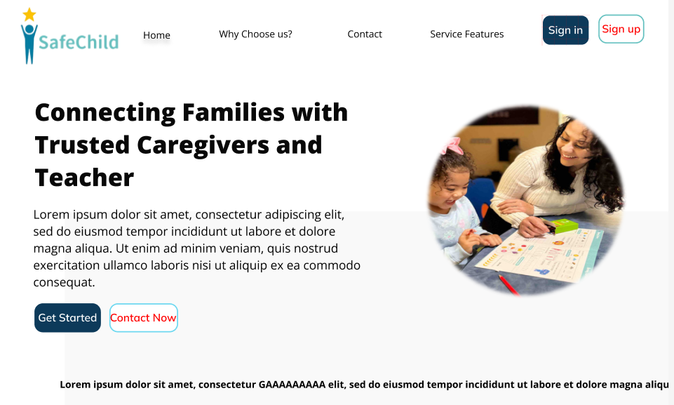
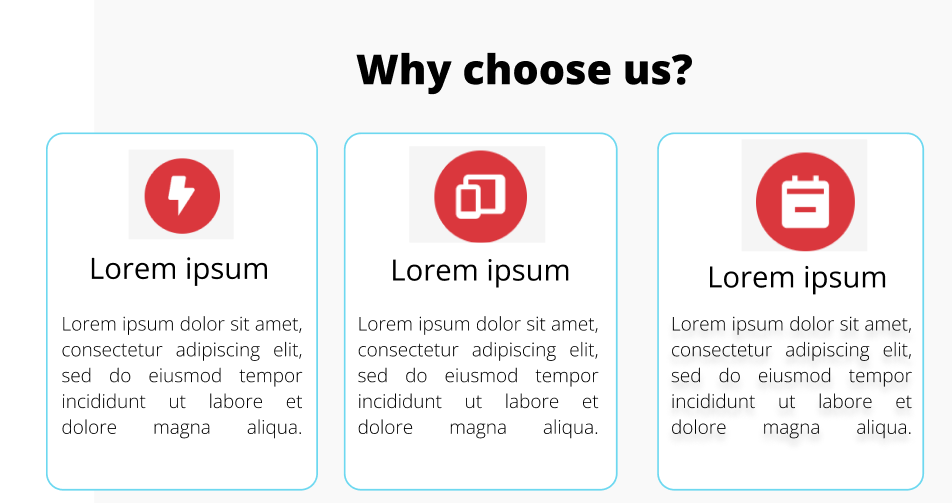
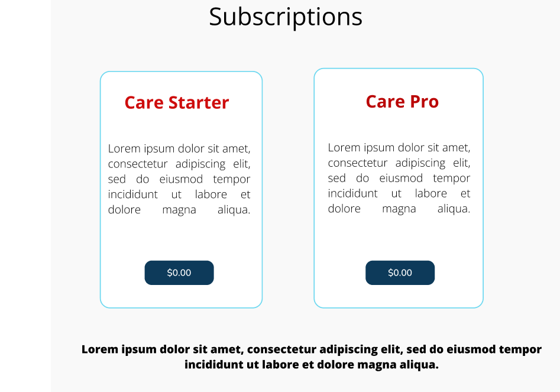
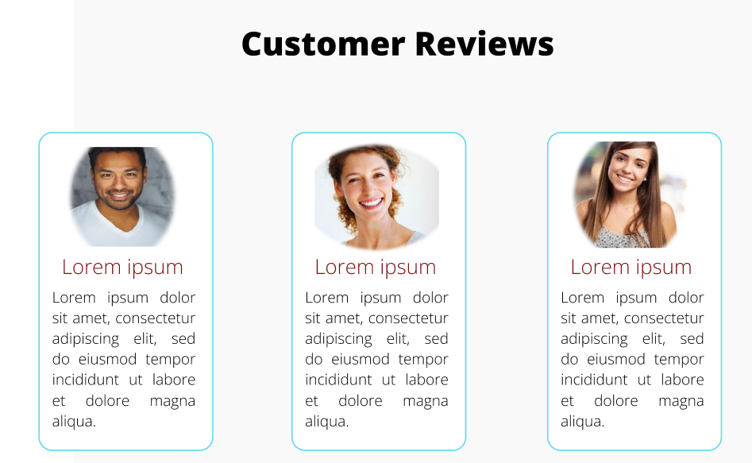
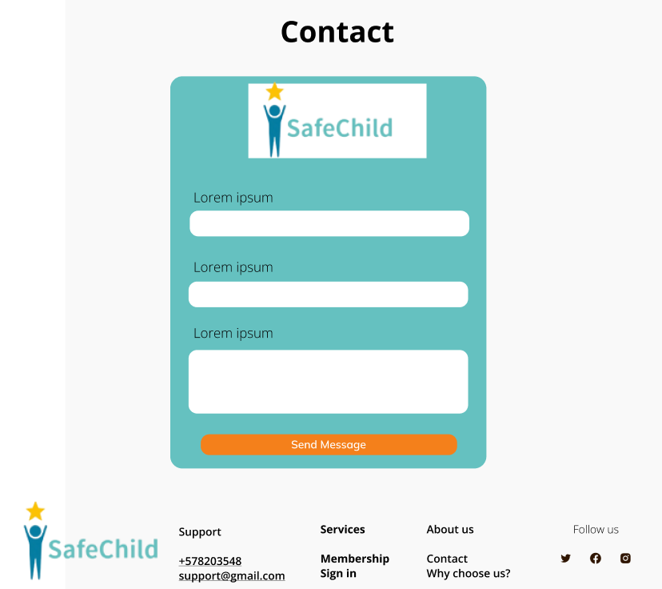
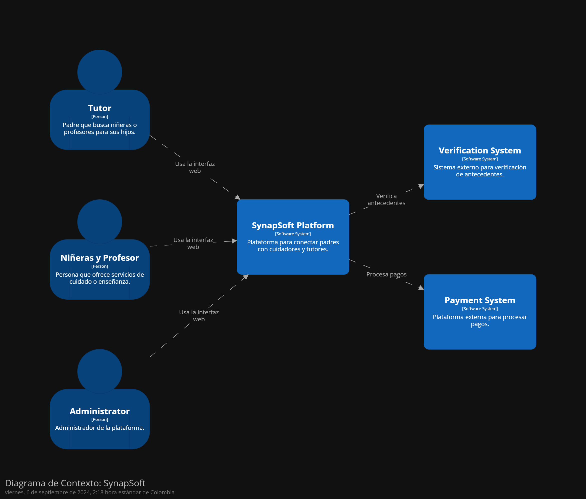
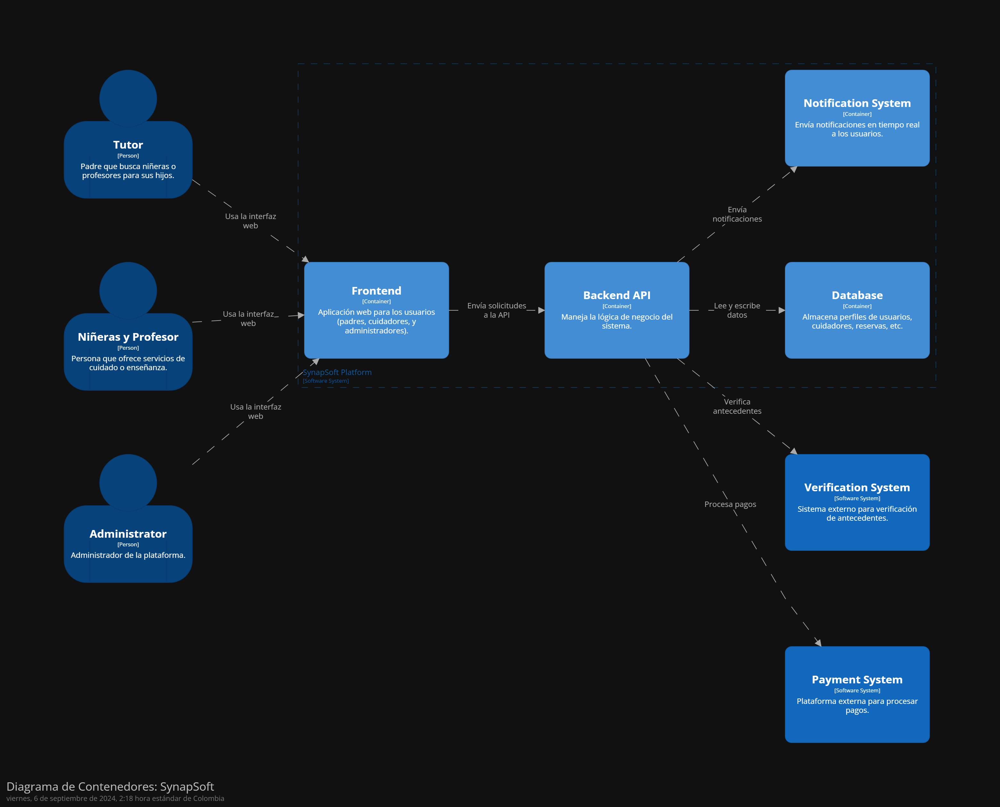
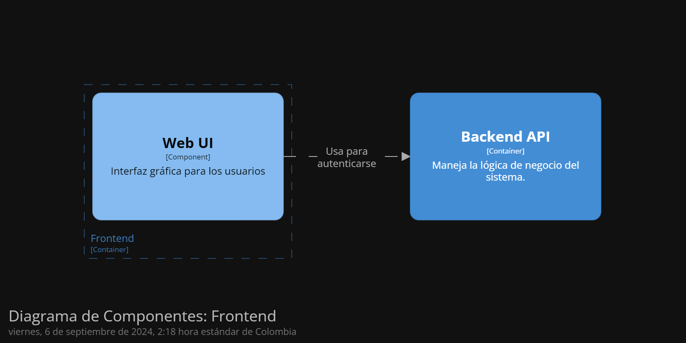
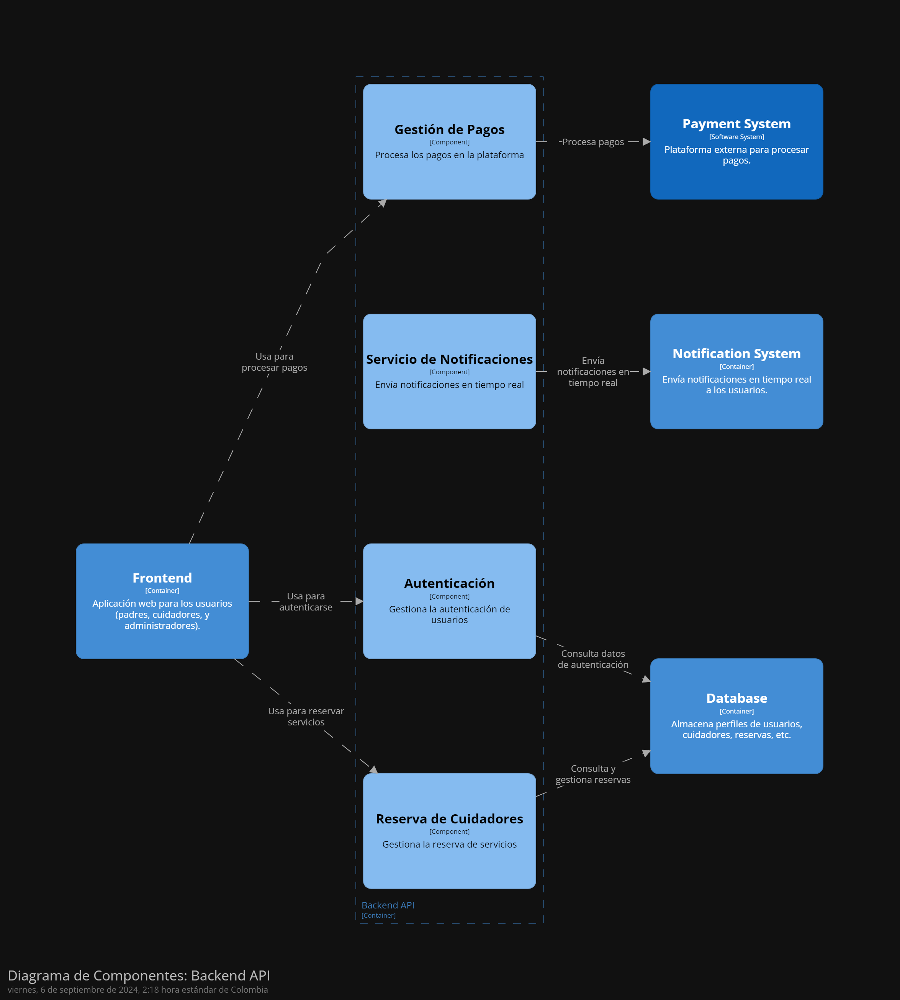

<h3 align="center"> Universidad Peruana de Ciencias Aplicadas </h3>

<h3 align="center"> Ingeniería de Software </h3>
<h3 align="center"> Ciclo 2024 - 2 </h3>

<br>

<div align="center">
  
</div>

<br>
<h3 align="center"> Desarrollo de Aplicaciones Open Source - WS51 </h3>
<h3 align="center"> Profesor del Curso: Juan Antonio Flores Moroco </h3>
<h3 align="center"> "INFORME DE TRABAJO FINAL"</h3>
<h3 align="center"> EMPRESA DE INICIO: SYNAPSOFT </h3>

<h3 align="center"> PRODUCTO: "SafeChild"</h3>

<div align="center">

| Miembro                                |    Código     |
| :------------------------------------- | :-----------: |
| Meza Camayo, Lynn Jeeferzon            | U20201C320    |
| Aliaga Pimentel, George Arturo         | U20211C273    |
| Sanchez Ignacio, Jefrey Martin         | U202113324    |
| Palomino Tito, Abraham Joel            | U202113324    |
| Grandez Mansilla, Jean Pierre          | U202212484    |

</div>

<h3 align="center"> 2024 </h3>

<br>

# <font color="red">**Registro de Versiones del Informe**</font>

<table BORDER>
    <tr>
        <td>VERSION</td>
        <td>FECHA</td>
        <td> AUTOR </td>
        <td>DESCRIPCION DE MODIFICACION</td>
    </tr>
    <tr>
        <td>01</td>
        <td>17/08/2024</td>
        <td> Lynn Meza Camayo </td>
        <td>Formato del documento</td>
    </tr>
    <tr>
        <td>02</td>
        <td>20/08/2024</td>
        <td>Jefrey Sanchez Ignacio</td>
        <td>Antecedentes y problematicas</td>
    </tr>
    <tr>
        <td>03</td>
        <td>20/08/2024</td>
        <td>George Aliaga Pimentel</td>
        <td>Lean UX Hypothesis Statements</td>
    </tr>
    <tr>
        <td>04</td>
        <td>21/08/24</td>
        <td>Lynn Meza Camayo</td>
        <td>Desarrollo del descipción de la StartUp y segmentos Objetivos</td>
    </tr>
    <tr>
        <td>05</td>
        <td>21/08/24</td>
        <td>Jean Grandez Mansilla</td>
        <td>Desarrollo del Lean UX Problem Statements, Assumptions y Canvas</td>
    </tr>
    <tr>
        <td>06</td>
        <td>27/08/24</td>
        <td>Jean Grandez Mansilla</td>
        <td>Desarrollo del User person y User task Matrix</td>
    </tr>
    <tr>
        <td>07</td>
        <td>29/08/24</td>
        <td>George Aliaga Pimentel</td>
        <td>Desarrollo del Análisis competitivo, Estrategias y tácticas frente a competidores , 1 entrevista y analisis</td>
    </tr>
    <tr>
        <td>08</td>
        <td>30/08/24</td>
        <td>Jefrey Sanchez Ignacio</td>
        <td>Desarrollo del empathy mapping, As-Is scenario mapping y 3 entrevista y analisis de niñeras/tutores </td>
    </tr>
    <tr>
        <td>09</td>
        <td>30/08/24</td>
        <td>Jean Grandez Mansilla</td>
        <td>>Desarrollo del User Journey Mapping y 1 entrevista y analisis entrevista tutores</td>
    </tr>
    <tr>
        <td>10</td>
        <td>30/08/24</td>
        <td>Lynn Meza Camayo</td>
        <td>Desarrollo del User Stories, Impact mapping y el  Product Backlog</td>
    </tr>
</table>

# <font color="red">**Project Report Collaboration Insights**</font>

URL del repositorio de la Organizacion: <https://github.com/Grupo4-WS51-SynapSoft>

En el desarrollo del informe, hemos adoptado un enfoque sistemático utilizando un sistema de control de versiones basado en ramas para organizar y gestionar las actividades de elaboración. Este método ha permitido que cada miembro del equipo trabaje de manera independiente en diferentes aspectos del informe, asegurando una integración eficiente y controlada de los avances.

Entregrable 1 o TB1 : (17-08-24 a 23-08-24)

<div align="center">
  
</div>

Cada miembro del equipo ha trabajado en ramas específicas para desarrollar diferentes partes del informe.

- Versión 01 (17/08/2024) - Lynn Meza Camayo
  - Descripción: Se realizó una revisión completa del formato del documento, ajustando estilos de encabezados, márgenes y elementos gráficos para mejorar la claridad y uniformidad.

<div align="center">
  
</div>

- Versión 02 (20/08/2024) - Jefrey Sanchez Ignacio
  - Descripción: Se documentaron los antecedentes relevantes y las problemáticas que el proyecto busca resolver, proporcionando contexto y base para el desarrollo posterior.

  <div align="center">
  
  </div> 

- Versión 03 (20/08/2024) - George Aliaga Pimentel
  - Descripción: Se formularon y documentaron las hipótesis clave sobre el comportamiento de los usuarios, estableciendo la base para la validación del proyecto.

  <div align="center">
  
  </div> 

- Versión 04 (21/08/2024) - Lynn Meza Camayo
  - Descripción: Se elaboró una descripción detallada de la StartUp y se definieron los segmentos objetivos.

  <div align="center">
  
  </div> 

- Versión 05 (21/08/2024) - Jean Grandez Mansilla
  - Descripción: Se definieron las declaraciones de problemas y suposiciones, y se completó el Lean UX Canvas para integrar todos los elementos clave del proyecto.

  <div align="center">
  
  </div> 

# <font color="red">**Contenido**</font>
### Tabla de contenidos
- [**Registro de Versiones del Informe**](#registro-de-versiones-del-informe)
- [**Project Report Collaboration Insights**](#project-report-collaboration-insights)
- [**Contenido**](#contenido)
    - [Tabla de contenidos](#tabla-de-contenidos)
- [**Student Outcome**](#student-outcome)
- [ **Capítulo I: Introducción** ](#-capítulo-i-introducción-)
  - [**1.1. Startup Profile**](#11-startup-profile)
    - [**1.1.1. Descripción de la Startup**](#111-descripción-de-la-startup)
    - [**1.1.2. Perfiles de integrantes del equipo**](#112-perfiles-de-integrantes-del-equipo)
  - [**1.2. Solution Profile**](#12-solution-profile)
    - [**1.2.1 Antecedentes y problemática**](#121-antecedentes-y-problemática)
    - [What (¿Qué?)](#what-qué)
    - [Who (¿Quién?)](#who-quién)
    - [Where (¿Dónde?)](#where-dónde)
    - [When (¿Cuándo?)](#when-cuándo)
    - [Why (¿Por qué?)](#why-por-qué)
    - [How (¿Cómo?)](#how-cómo)
    - [How much (¿Cuánto?)](#how-much-cuánto)
    - [**1.2.2 Lean UX Process**](#122-lean-ux-process)
    - [1.2.2.1. Lean UX Problem Statements](#1221-lean-ux-problem-statements)
      - [Problem Statement para Padres:](#problem-statement-para-padres)
      - [Problem Statement para Cuidadores:](#problem-statement-para-cuidadores)
    - [1.2.2.2. Lean UX Assumptions](#1222-lean-ux-assumptions)
    - [**1.2.2.3. Lean UX Hypothesis Statements**](#1223-lean-ux-hypothesis-statements)
    - [**1.2.2.4. Lean UX Canvas**](#1224-lean-ux-canvas)
        - [1.2.2.1. Lean UX Canvas](#1221-lean-ux-canvas)
  - [**1.3. Segmentos objetivo**](#13-segmentos-objetivo)
- [ **Capítulo II: Requirements Elicitation \& Analysis**](#-capítulo-ii-requirements-elicitation--analysis)
  - [**2.1. Competidores**](#21-competidores)
    - [**2.1.1. Análisis competitivo**](#211-análisis-competitivo)
    - [**2.1.2. Estrategias y tácticas frente a competidores**](#212-estrategias-y-tácticas-frente-a-competidores)
  - [**2.2. Entrevistas**](#22-entrevistas)
    - [**2.2.1. Diseño de entrevistas**](#221-diseño-de-entrevistas)
    - [**2.2.2. Registro de entrevistas**](#222-registro-de-entrevistas)
    - [**2.2.3. Análisis de entrevistas**](#223-análisis-de-entrevistas)
  - [**2.3. Needfinding**](#23-needfinding)
    - [**2.3.1. User Personas**](#231-user-personas)
    - [**2.3.2. User Task Matrix**](#232-user-task-matrix)
    - [**2.3.3. User Journey Mapping**](#233-user-journey-mapping)
    - [**2.3.4. Empathy Mapping**](#234-empathy-mapping)
    - [**2.3.5. As-is Scenario Mapping**](#235-as-is-scenario-mapping)
  - [**2.4. Ubiquitous Language**](#24-ubiquitous-language)
- [ **Capítulo III: Requirements Specification**](#-capítulo-iii-requirements-specification)
  - [**3.1. To-Be Scenario Mapping**](#31-to-be-scenario-mapping)
  - [**3.2. User Stories**](#32-user-stories)
  - [**3.3. Impact Mapping**](#33-impact-mapping)
  - [**3.4. Product Backlog**](#34-product-backlog)
- [**Capítulo IV: Product Design**](#capítulo-iv-product-design)
  - [**4.1. Style Guidelines**](#41-style-guidelines)
    - [**4.1.1. General Style Guidelines**](#411-general-style-guidelines)
    - [**4.1.2. Web Style Guidelines**](#412-web-style-guidelines)
  - [**4.2. Information Architecture**](#42-information-architecture)
    - [**4.2.1. Organization Systems**](#421-organization-systems)
    - [**4.2.2. Labeling Systems**](#422-labeling-systems)
    - [**4.2.3. SEO Tags and Meta Tags**](#423-seo-tags-and-meta-tags)
    - [**4.2.4. Searching Systems**](#424-searching-systems)
    - [**4.2.5. Navigation Systems**](#425-navigation-systems)
  - [**4.3. Landing Page UI Design**](#43-landing-page-ui-design)
    - [**4.3.1. Landing Page Wireframe**](#431-landing-page-wireframe)
    - [**4.3.2. Landing Page Mock-up**](#432-landing-page-mock-up)
  - [**4.4. Web Applications UX/UI Design**](#44-web-applications-uxui-design)
    - [**4.4.1. Web Applications Wireframes**](#441-web-applications-wireframes)
    - [**4.4.2. Web Applications Wireflow Diagrams**](#442-web-applications-wireflow-diagrams)
    - [**4.4.3. Web Applications Mock-ups**](#443-web-applications-mock-ups)
    - [**4.4.4. Web Applications User Flow Diagrams**](#444-web-applications-user-flow-diagrams)
  - [**4.5. Web Applications Prototyping**](#45-web-applications-prototyping)
  - [**4.6. Domain-Driven Software Architecture**](#46-domain-driven-software-architecture)
    - [**4.6.1. Software Architecture Context Diagram**](#461-software-architecture-context-diagram)
    - [**4.6.2. Software Architecture Container Diagrams**](#462-software-architecture-container-diagrams)
    - [**4.6.3. Software Architecture Components Diagrams**](#463-software-architecture-components-diagrams)
  - [**4.7. Software Object-Oriented Design**](#47-software-object-oriented-design)
    - [**4.7.1. Class Diagrams**](#471-class-diagrams)
    - [**4.7.2. Class Dictionary**](#472-class-dictionary)
  - [**4.8. Database Design**](#48-database-design)
    - [**4.8.1. Database Diagram**](#481-database-diagram)
- [**Capítulo V: Product Implementation, Validation \& Deployment**](#capítulo-v-product-implementation-validation--deployment)
  - [**5.1. Software Configuration Management**](#51-software-configuration-management)
    - [**5.1.1. Software Development Environment Configuration**](#511-software-development-environment-configuration)
    - [**5.1.2. Source Code Management**](#512-source-code-management)
    - [**5.1.3. Source Code Style Guide \& Conventions**](#513-source-code-style-guide--conventions)
    - [**5.1.4. Software Deployment Configuration**](#514-software-deployment-configuration)
  - [**5.2. Landing Page, Services \& Applications Implementation**](#52-landing-page-services--applications-implementation)
    - [**5.2.1. Sprint 1**](#521-sprint-1)
    - [**5.2.1.1. Sprint Planning 1**](#5211-sprint-planning-1)
    - [**5.2.1.2. Sprint Backlog 1**](#5212-sprint-backlog-1)
    - [**5.2.1.3. Development Evidence for Sprint Review**](#5213-development-evidence-for-sprint-review)
    - [**5.2.1.4. Testing Suite Evidence for Sprint Review**](#5214-testing-suite-evidence-for-sprint-review)
    - [**5.2.1.5. Execution Evidence for Sprint Review**](#5215-execution-evidence-for-sprint-review)
    - [**5.2.1.6. Services Documentation Evidence for Sprint Review**](#5216-services-documentation-evidence-for-sprint-review)
    - [**5.2.1.7. Software Deployment Evidence for Sprint Review**](#5217-software-deployment-evidence-for-sprint-review)
    - [**5.2.1.8. Team Collaboration Insights during Sprint**](#5218-team-collaboration-insights-during-sprint)
  - [**5.3. Validation Interviews**](#53-validation-interviews)
    - [**5.3.1. Diseño de Entrevistas**](#531-diseño-de-entrevistas)
    - [**5.3.2. Registro de Entrevistas**](#532-registro-de-entrevistas)
    - [**5.3.3. Evaluaciones según heurísticas**](#533-evaluaciones-según-heurísticas)
  - [**5.4. Video About-the-Product**](#54-video-about-the-product)
- [**Conclusiones**](#conclusiones)
- [**Conclusiones y recomendaciones**](#conclusiones-y-recomendaciones)
- [**Video About-the-Team**](#video-about-the-team)
- [**Bibliografía**](#bibliografía)
- [**Anexos**](#anexos)

# <font color="red">**Student Outcome**</font>

# <font color="red"> **Capítulo I: Introducción** </font>
## **1.1. Startup Profile**
### **1.1.1. Descripción de la Startup**

SynapSoft es una empresa emergente en el ámbito del desarrollo de software, comprometida con la creación de soluciones tecnológicas a medida y de alta calidad. Nació de la iniciativa de un grupo de ingenieros de software, quienes se formaron en la Universidad Peruana de Ciencias Aplicadas. 
SynapSoft se distingue por su enfoque centrado en el cliente, colaborando estrechamente con ellos para identificar sus necesidades y ofrecer soluciones tecnológicas que se alineen con sus objetivos específicos.

El equipo de SynapSoft está conformado por desarrolladores, diseñadores creativos y analistas de negocios altamente capacitados, que trabajan de manera conjunta para desarrollar soluciones escalables y personalizadas. Entre sus servicios destacan el desarrollo de software a medida, la creación de aplicaciones móviles y el diseño de sitios web. SynapSoft utiliza tecnologías de última generación y sigue un enfoque ágil en sus procesos, asegurando que las soluciones que ofrece sean robustas, eficientes y adaptables. Además, la empresa brinda soporte continuo y servicios de mantenimiento para garantizar la operación óptima de las soluciones entregadas.

**Visión:**
La visión de SynapSoft es consolidarse como un referente global en el desarrollo de software, proporcionando soluciones personalizadas y de alta calidad que impulsen el éxito de empresas y organizaciones a nivel mundial.

**Misión:**
La misión de SynapSoft es diseñar y desarrollar soluciones tecnológicas innovadoras y adaptadas a las necesidades de sus clientes, contribuyendo al crecimiento y eficiencia de empresas en una amplia gama de sectores.

### **1.1.2. Perfiles de integrantes del equipo**
<div align="center">


</div>

## **1.2. Solution Profile**

### **1.2.1 Antecedentes y problemática**
### What (¿Qué?)
**Problema:** La creciente dificultad para acceder a cuidadores calificados y confiables para el cuidado infantil y la educación en el hogar. Este problema se traduce en un déficit en la atención personalizada que los niños necesitan para su desarrollo.  
**Consecuencias:** Esta situación genera un alto nivel de estrés en los padres, quienes se sienten inseguros acerca del bienestar de sus hijos y la calidad de la educación que reciben en ausencia de supervisión adecuada.

### Who (¿Quién?)
**Afectados:** Principalmente, padres y tutores que requieren apoyo adicional para equilibrar sus responsabilidades laborales y familiares. Este grupo incluye padres trabajadores, madres solteras y familias con múltiples hijos.  
**Cuidadores:** Niñeras, tutores y educadores en busca de oportunidades laborales, quienes a menudo carecen de una plataforma eficiente para conectarse con las familias que necesitan sus servicios.

### Where (¿Dónde?)
**Contexto:** En entornos urbanos y suburbanos de Perú, donde las familias enfrentan desafíos logísticos para encontrar cuidadores. Esto se agrava en áreas con alta densidad poblacional y donde las redes familiares son limitadas.

### When (¿Cuándo?)
**Oportunidad:** La demanda de servicios de cuidado infantil y educación ha aumentado notablemente, especialmente tras la pandemia de COVID-19. Muchos padres buscan alternativas flexibles que se adapten a sus horarios y necesidades, haciendo que este sea el momento ideal para abordar esta problemática.

### Why (¿Por qué?)
**Necesidad:** Los padres desean asegurar el bienestar y desarrollo educativo de sus hijos, pero enfrentan barreras como la falta de información sobre cuidadores verificados, altos costos y la incertidumbre sobre la calidad de los servicios disponibles. Esta situación no solo afecta la confianza de los padres, sino que también impacta el desarrollo emocional y educativo de los niños.

### How (¿Cómo?)
**Soluciones:** Se propone desarrollar un sistema integral que facilite la búsqueda y conexión entre padres y cuidadores, garantizando que los perfiles de los cuidadores sean verificados a través de un proceso riguroso. Además, la implementación de recursos educativos y seguimiento del desarrollo infantil puede fortalecer la relación entre padres y cuidadores.

### How much (¿Cuánto?)
**Impacto económico:** Los costos de contratar cuidadores a menudo son prohibitivos y pueden variar significativamente. La falta de opciones accesibles puede llevar a decisiones que no favorecen el bienestar infantil, lo que a su vez afecta la estabilidad emocional de las familias. La implementación de una plataforma eficiente puede no solo optimizar costos, sino también mejorar la calidad del servicio ofrecido.
### **1.2.2 Lean UX Process**
### 1.2.2.1. Lean UX Problem Statements

#### Problem Statement para Padres:

"Los padres enfrentan dificultades para encontrar cuidadores y educadores confiables que ofrezcan un cuidado infantil y educación de calidad en el hogar. Esto genera un alto nivel de estrés, afectando su capacidad para equilibrar responsabilidades laborales y familiares, mientras se aseguran de que sus hijos reciban la atención adecuada."

#### Problem Statement para Cuidadores:

"Los cuidadores y educadores carecen de una plataforma eficiente que les permita conectar con familias que necesitan sus servicios, limitando sus oportunidades laborales y dificultando el acceso de las familias a servicios confiables y personalizados."

### 1.2.2.2. Lean UX Assumptions

- **Asumimos que** los padres valorarán una plataforma que les permita acceder fácilmente a perfiles verificados de cuidadores y educadores, organizados según sus necesidades específicas.
  - **Sabremos que esto es cierto cuando** veamos un aumento en el uso regular de la plataforma para reservar servicios.

- **Asumimos que** los cuidadores y educadores estarán dispuestos a unirse a la plataforma si se les ofrece una audiencia de familias que buscan servicios personalizados y verificados.
  - **Sabremos que esto es cierto cuando** observemos un incremento en el número de cuidadores registrados y activos.

- **Asumimos que** la inclusión de actualizaciones en tiempo real sobre las actividades de los niños será un factor decisivo para los padres al elegir la plataforma.
  - **Sabremos que esto es cierto cuando** notemos un alto nivel de satisfacción entre los padres que utilizan esta funcionalidad.

- **Asumimos que** los recursos educativos y el seguimiento del desarrollo infantil atraerán tanto a padres como a educadores, mejorando la retención en la plataforma.
  - **Sabremos que esto es cierto cuando** observemos un uso continuo de estos recursos por parte de ambos grupos.

### **1.2.2.3. Lean UX Hypothesis Statements**

<ol>
<li> <b>Creemos que</b> que los padres estarán satisfechos con la capacidad de buscar y seleccionar cuidadores verificados según sus necesidades específicas. <b>Sabremos que</b> esta afirmación sea cierta <b>cuando</b> observemos un alto índice de retención y repetición de reservas de servicios en la plataforma.
</li>
<li> <b>Creemos que</b> los cuidadores apreciarán la facilidad de uso de la plataforma para conectar con familias que requieren sus servicios. <b>Sabremos que</b> esta suposición es cierta cuando veamos un incremento en la cantidad de cuidadores registrados y activos en la plataforma.
</li>
<li> <b>Creemos que</b> la implementación de un proceso de verificación riguroso para los cuidadores mejorará la confianza de los padres en la plataforma. <b>Sabremos que</b> esta suposición es cierta cuando notemos una reducción en las consultas relacionadas con la seguridad y un aumento en el número de usuarios que completan el proceso de registro.
</ol>

### **1.2.2.4. Lean UX Canvas**

##### 1.2.2.1. Lean UX Canvas
<table>
  <tr>
    <th valign="top">
      <p><b>1. Business Problem</b></p>
      <p>Los padres tienen dificultades para encontrar cuidadores y educadores confiables para sus hijos, lo que genera estrés y afecta su capacidad para equilibrar sus responsabilidades. Los cuidadores carecen de una plataforma efectiva para ofrecer sus servicios.</p>
    </th>
    <th valign="top">
      <p><b>2. Business Outcomes</b></p>
      <p>- Aumento en la retención de usuarios (padres y cuidadores).</p>
      <p>- Incremento en la tasa de reservas repetidas.</p>
      <p>- Mejora en la satisfacción del usuario.</p>
      <p>- Expansión de la base de usuarios.</p>
    </th>
    <th rowspan="2" valign="top">
      <p><b>5. Solutions</b></p>
      <p>- Desarrollo de una plataforma que conecte a padres con cuidadores verificados.</p>
      <p>- Funcionalidades como la programación de sesiones, actualizaciones en tiempo real, recursos educativos, y seguimiento del desarrollo infantil.</p>
    </th>
  </tr>
  <tr>
    <td valign="top">
      <p><b>3. Users</b></p>
      <p>- Usuarios primarios: Padres que necesitan servicios de cuidado infantil y educación en el hogar.</p>
      <p>- Usuarios secundarios: Niñeras, tutores, y educadores en busca de oportunidades laborales.</p>
      <p>- Clientes: Familias que pagan por los servicios y cuidadores que pagan por publicidad o acceso a más oportunidades.</p>
    </td>
    <td valign="top">
      <p><b>4. User Benefits</b></p>
      <p>- Padres: Acceso a perfiles verificados de cuidadores y educadores, posibilidad de programar servicios según sus necesidades, y recibir actualizaciones en tiempo real sobre las actividades de sus hijos.</p>
      <p>- Cuidadores: Oportunidades laborales directas y una plataforma que valida y promueve sus servicios.</p>
    </td>
  </tr>
  <tr>
    <td valign="top">
      <p><b>6. Hypothesis</b></p>
      <p>- Creemos que los padres estarán más inclinados a usar la plataforma si pueden confiar en la calidad y verificación de los cuidadores.</p>
      <p>- Sabremos que esta suposición es cierta cuando veamos un aumento en la tasa de retención y un mayor uso de las funciones de seguridad.</p>
    </td>
    <td valign="top">
      <p><b>7. What’s the most important thing we need to learn first?</b></p>
      <p>Necesitamos validar si los usuarios valorarán la seguridad, personalización y la calidad del servicio proporcionado por la plataforma.</p>
    </td>
    <td valign="top">
      <p><b>8. What’s the least amount of work we need to do to learn the next most important thing?</b></p>
      <p>Lanzaremos una versión beta con funcionalidades clave y analizaremos la adopción y el feedback para validar la propuesta de valor.</p>
    </td>
  </tr>
</table>


## **1.3. Segmentos objetivo**

Nuestro segmento objetivo abarca a todos aquellos padres y tutores que buscan soluciones confiables y flexibles para el cuidado infantil permitiéndoles combinar sus responsabilidades laborales con la tranquilidad de saber que sus hijos están bien atendidos.Además, la plataforma también se dirige a cuidadores, tutores y educadores que desean expandir sus oportunidades laborales y generar ingresos a través de la prestación de servicios personalizados y verificados. A continuación, se presenta características demográficas relevantes y información estadística que respalda la importancia de cada segmento.

**1.Padres**

- Este segmento abarca a todos los padres y tutores que buscan soluciones confiables y flexibles para el cuidado infantil y la educacion para el hogar. Ademas, incluye a familias que buscan servicios de cuidado infantil y opciones educativas personalizadas en el hogar. 

- #### Caracteristicas Demograficas
    - Edad: 20-45 años.
    - Estado Civil: Casados, en pareja, o monoparentales.
    - Motivaciones: Seguridad, conveniencia, eduación de calidad, flexibilidad del programa


**2.Cuidadores (Niñeras y Tutores)**

- Este segmento está abarca a todas las personas que trabajan como niñeras, cuidadoras infantiles, o asistentes domésticas. Son profesionales que buscan incrementar sus ingresos y expandir sus oportunidades laborales ofreciendo servicios de cuidado infantil de alta calidad. Estos cuidadores suelen estar altamente motivados por la flexibilidad laboral que les permite manejar su propio horario y trabajar en diferentes entornos.

- #### Caracteristicas Demograficas
    - **Edad:** 18-45 años.
    - **Educación:** Varía desde secundaria completa hasta educación superior, con algunos poseyendo certificaciones específicas en cuidado infantil.
    - **Estado Civil:** Casados, en pareja, o monoparentales.
    - **Motivaciones:** Flexibilidad de sus horarios, la posibilidad de trabajar con familias que valoran sus habilidades y para establecer relaciones laborales estables y duraderas con las familias a las que sirven.


# <font color="red"> **Capítulo II: Requirements Elicitation & Analysis**</font>
## **2.1. Competidores**
### **2.1.1. Análisis competitivo**

<div align="center">

<table>
  <tr>
    <th colspan="6">Competitive Analysis Landscape</th>
  </tr>
  <tr>
    <td colspan="2">¿Por qué llevar este análisis?</td>
    <td colspan="4">Para proporcionar información valiosa acerca de los competidores en el sector de servicios de cuidado infantil, lo cual nos servirá para mejorar la calidad de nuestro servicio y posicionar mejor nuestra oferta.</td>
  </tr>
  <tr>
    <td colspan="2">&nbsp;</td>
    <td>SafeChild</td>
    <td>Care.com</td>
    <td>Sittercity</td>
    <td>UrbanSitter</td>
  </tr>
  <tr>
    <td rowspan="2">Perfil</td>
    <td>Overview</td>
    <td>SafeChild es una plataforma integral para conectar a padres con cuidadores de confianza, utilizando tecnología avanzada para verificación de antecedentes y gestión de reservas.</td>
    <td>Care.com es una plataforma globalmente reconocida que ofrece servicios de cuidado infantil, cuidado de ancianos y más, con una extensa base de datos de cuidadores.</td>
    <td>Sittercity es una plataforma que conecta a familias con niñeras y cuidadores a través de una base de datos amplia y detallada de perfiles de cuidadores.</td>
    <td>UrbanSitter utiliza una red social para recomendar y conectar a padres con cuidadores, facilitando la contratación a través de referencias de amigos y familiares.</td>
  </tr>
  <tr>
    <td>Ventaja competitiva: ¿Qué valor ofrece a los clientes?</td>
    <td>Verificación exhaustiva de cuidadores, tecnología avanzada para gestión y comunicación, sistema de referencias confiables.</td>
    <td>Base de datos extensa de cuidadores verificados, herramientas robustas para la búsqueda y contratación, amplia presencia en el mercado.</td>
    <td>Interfaz sencilla, perfiles detallados de cuidadores, revisiones y valoraciones de usuarios, enfoque en facilidad de uso.</td>
    <td>Conexión rápida con cuidadores a través de referencias, perfil detallado de cuidadores, enfoque en la confianza y la comunidad.</td>
  </tr>
  <tr>
    <td rowspan="2">Perfil de Marketing</td>
    <td>Mercado Objetivo</td>
    <td>Padres que buscan una solución completa y confiable para encontrar cuidadores, y cuidadores que buscan una plataforma para ofrecer sus servicios.</td>
    <td>Padres y cuidadores en busca de una plataforma robusta para diversos tipos de cuidado, desde cuidado infantil hasta cuidado de ancianos.</td>
    <td>Padres de niños pequeños en busca de cuidadores de confianza y servicios relacionados.</td>
    <td>Padres que valoran la recomendación social y la confianza en la selección de cuidadores.</td>
  </tr>
  <tr>
    <td>Estrategias de Marketing</td>
    <td>Marketing digital, SEO, campañas en redes sociales, asociaciones con empresas de referencia, eventos educativos.</td>
    <td>Marketing en redes sociales, SEO, publicidad digital, asociaciones con proveedores de servicios relacionados con la familia.</td>
    <td>Publicidad dirigida, marketing en redes sociales, contenido educativo, colaboraciones con comunidades locales.</td>
    <td>Marketing a través de redes sociales, enfoque en la recomendación social, colaboraciones con influencers y grupos comunitarios.</td>
  </tr>
  <tr>
    <td rowspan="3">Perfil de Producto</td>
    <td>Productos & Servicios</td>
    <td>Plataforma de conexión de cuidadores, verificación de antecedentes, gestión de reservas, sistema de referencias, comunicación en tiempo real.</td>
    <td>Plataforma para encontrar cuidadores, incluyendo niñeras, tutores y cuidadores de ancianos, con herramientas para contratación y verificación.</td>
    <td>Servicios para encontrar niñeras, cuidadores y tutores, con perfiles detallados y herramientas para la gestión de reservas y pagos.</td>
    <td>Plataforma para reservar cuidadores a través de referencias de amigos, con perfiles detallados y herramientas de comunicación.</td>
  </tr>
  <tr>
    <td>Precios & Costos</td>
    <td>Varía según el servicio de cuidado y el nivel de verificación; tarifas competitivas basadas en el mercado.</td>
    <td>Precios varían según el tipo de servicio y la experiencia del cuidador, con opciones de suscripción disponibles.</td>
    <td>Precios competitivos basados en la experiencia del cuidador y el tipo de servicio, con tarifas de suscripción opcionales.</td>
    <td>Precios varían según el cuidador y el tipo de servicio, con opciones para tarifas de referencia y suscripción.</td>
  </tr>
  <tr>
    <td>Canales de Distribución (Web y/o Móvil)</td>
    <td>Distribución a través de su página web y aplicación móvil.</td>
    <td>Distribución a través de su página web y aplicación móvil.</td>
    <td>Distribución a través de su página web y aplicación móvil.</td>
    <td>Distribución a través de su página web y aplicación móvil.</td>
  </tr>
  <tr>
    <td rowspan="4">Análisis SWOT</td>
    <td>Fortalezas</td>
    <td>Verificación exhaustiva de cuidadores, tecnología avanzada, sistema de referencias confiables.</td>
    <td>Amplia base de datos de cuidadores verificados, herramientas robustas para búsqueda y contratación, alta visibilidad en el mercado.</td>
    <td>Interfaz fácil de usar, perfiles detallados, revisiones de usuarios confiables.</td>
    <td>Enfoque en referencias sociales, perfiles detallados, facilidad de conexión con cuidadores confiables.</td>
  </tr>
  <tr>
    <td>Debilidades</td>
    <td>Dependencia de la tecnología, posible resistencia de usuarios menos tecnológicos.</td>
    <td>Competencia con plataformas similares, necesidad de mantener la calidad del servicio a gran escala.</td>
    <td>Dependencia de las revisiones de usuarios, posible variabilidad en la calidad de los cuidadores.</td>
    <td>Dependencia de la red social para referencias, posible limitación en la disponibilidad de cuidadores.</td>
  </tr>
  <tr>
    <td>Oportunidades</td>
    <td>Expansión a nuevos mercados, integración de nuevas tecnologías, asociaciones estratégicas.</td>
    <td>Expansión de servicios, integración con otras plataformas, oportunidades de asociaciones estratégicas.</td>
    <td>Expansión en áreas no cubiertas, mejora de la interfaz y funciones.</td>
    <td>Expansión de la red de referencias, mejor integración con redes sociales.</td>
  </tr>
  <tr>
    <td>Amenazas</td>
    <td>Competencia intensa, cambios en regulaciones, crisis económicas.</td>
    <td>Competencia intensa, posibles cambios en regulaciones, crisis económicas.</td>
    <td>Competencia intensa, necesidad de mantener la calidad del servicio.</td>
    <td>Competencia de plataformas similares, posibles cambios en las políticas de redes sociales.</td>
  </tr>
</table>

</div>

</body>
</html>

### **2.1.2. Estrategias y tácticas frente a competidores**

Tras analizar a cada uno de nuestros competidores, las estrategias y tácticas que emplearemos serán:

- Centrarnos en nuestro aporte de valor: Nosotros no solo proporcionamos una plataforma para encontrar cuidadores y niñeras, sino que también ofrecemos una experiencia completa para ambas partes: padres y cuidadores. Nuestro objetivo es crear una comunidad de confianza y calidad en el cuidado infantil, asegurando que los padres encuentren cuidadores confiables y que estos últimos puedan ofrecer sus servicios en un entorno seguro y reconocido. Buscamos que tanto padres como cuidadores se beneficien de nuestras características únicas, como verificación de antecedentes, recomendaciones basadas en experiencias, y herramientas avanzadas para gestionar y contratar servicios de manera eficiente.

- Hacer publicidad y marketing: Dado que algunos de nuestros competidores pueden no tener una presencia sólida en redes sociales o aplicaciones móviles, decidimos enfocarnos en una estrategia de marketing digital robusta. Promocionaremos nuestros servicios a través de redes sociales, destacando las historias de éxito de nuestras familias y cuidadores, compartiendo consejos sobre cuidado infantil y ofreciendo contenido valioso sobre la seguridad y el bienestar de los niños. También implementaremos campañas de publicidad en línea y colaboraciones con influencers en el ámbito del cuidado infantil para aumentar nuestra visibilidad y alcance.

- Estrategia de posicionamiento: Esperamos posicionarnos como la plataforma líder en la búsqueda y contratación de cuidadores y niñeras, destacando por nuestra calidad y confianza. Nuestra ventaja competitiva radica en la verificación exhaustiva de cuidadores y en las herramientas que facilitamos tanto para padres como para cuidadores. Además, nos enfocaremos en proporcionar un servicio personalizado, donde cada familia y cuidador pueda encontrar exactamente lo que necesitan, y donde la atención al cliente y la seguridad sean nuestras principales prioridades.


## **2.2. Entrevistas**
### **2.2.1. Diseño de entrevistas**

#### Entrevista General:

  1. ¿Podría compartir algunos de sus datos personales básicos?
  2. ¿Qué sitios web o aplicaciones utiliza con frecuencia para buscar información sobre cuidado infantil o servicios educativos?
  3. ¿Participa en algún grupo o foro en línea relacionado con el cuidado infantil? De ser así, ¿cuáles?
  4. ¿Cómo se informa sobre nuevas ofertas de servicios para el cuidado infantil? (Por ejemplo, recomendaciones, redes sociales, publicidad, etc.)

#### Para Padres:

  1. ¿Cuáles son los aspectos más importantes que valora en un servicio de cuidado infantil? (Por ejemplo, seguridad, flexibilidad, calidad educativa, etc.)
  2. ¿Cómo equilibra sus responsabilidades laborales con el cuidado de sus hijos?
  3. ¿Qué desafíos ha encontrado al buscar soluciones para el cuidado infantil?
  4. ¿Ha utilizado servicios de cuidado infantil anteriormente? ¿Cómo fue su experiencia?
  5. ¿Qué características considera imprescindibles en una plataforma de cuidado infantil?
  6. ¿Qué tipo de servicios educativos personalizados en el hogar le interesan?
  7. ¿Qué nivel de flexibilidad busca en los servicios de cuidado infantil?
  8. ¿Qué tan importante es para usted que los cuidadores estén verificados y certificados?
  9. ¿Cuál es su presupuesto aproximado para servicios de cuidado infantil?

#### Para Cuidadores (Niñeras y Tutores)

  1. ¿Qué lo motivó a trabajar en el área de cuidado infantil o tutoría?
  2. ¿Cuáles son los aspectos más importantes que valora en un empleo como cuidador o tutor? (Por ejemplo, flexibilidad, estabilidad, tipo de trabajo, etc.)
  3. ¿Qué desafíos ha enfrentado en su carrera profesional hasta ahora?
  4. ¿Qué tipo de servicios ofrece actualmente y cómo llegó a estos clientes?
  5. ¿Cómo encuentra nuevas oportunidades laborales o clientes?
  6. ¿Qué cualidades cree que son esenciales para ser un buen cuidador o tutor?
  7. ¿Qué nivel de flexibilidad busca en su trabajo?
  8. ¿Qué características valora en una plataforma que conecta cuidadores con familias?
  9. ¿Qué tan importante es para usted la posibilidad de trabajar en diferentes entornos y con diferentes familias?


### **2.2.2. Registro de entrevistas**
**Tutores/Padres**

<b>Entrevista 1 - Tutor</b><br/>

- Nombre: Fabrizio
- Apellidos: Sanchez Zamora
- Edad: 23 años
- Distrito: Chorrillos - Lima
- Minuto donde Empieza: 0:00
- Duración: 04:29 minutos

Evidencia de la reunión:

<div align="center">
    
</div>

Resumen de la entrevista:

Fabrizio nos comentó las dificultades que enfrenta día a día cuando se trata del cuidado y enseñanza de sus hijos,
además de la importancia de encontrar un cuidador confiable y calificado. Nos mencionó que actualmente utiliza
redes sociales para buscar información sobre cuidado infantil y educación en el hogar. También
destacó la importancia de la flexibilidad y la calidad educativa en los servicios que busca para sus hijos. Fabrizio
expresó su interés en una plataforma que ofrezca verificación de antecedentes y certificaciones para los cuidadores,
así como la posibilidad de acceder a servicios educativos personalizados en el hogar. En cuanto a su presupuesto, nos
comentó que está dispuesto a invertir en servicios de calidad para el cuidado de sus hijos.


<b>Entrevista 2-Tutor</b><br/>

- Nombre: Edwhin
- Apellidos: Palomino
- Edad: 53 años
- Distrito: Lima - Puente Piedra
- Minuto donde empieza: 4:31
- Duración: 17:13 minutos

Evidencia de la reunión:

<div align="center">
    
</div>

Resumen de la entrevista:

Edwhin Palomino expresa que, aunque no ha utilizado aplicaciones específicas para el cuidado infantil en Perú, reconoce el potencial de una plataforma que ofrezca mayor seguridad y confianza en los cuidadores. Destaca que la principal dificultad que ha enfrentado es la falta de servicios accesibles y confiables, así como la necesidad de equilibrar sus responsabilidades laborales con el cuidado de sus hijos, a menudo recurriendo a soluciones temporales y a veces insatisfactorias como recomendaciones personales y guarderías locales.

Finalmente, está dispuesto a pagar entre 30 y 50 soles por hora para el cuidado infantil, con la posibilidad de ajustar el costo para cuidados prolongados. En resumen, Edwhin busca una solución de cuidado infantil que ofrezca seguridad, flexibilidad y una plataforma intuitiva, con cuidadores verificados y capaces, y está dispuesto a invertir en un servicio que le proporcione tranquilidad y soporte en situaciones emergentes.

**Cuidadores/Educadores**
<b>Entrevista 4 - Niñera</b><br/>

- Nombre: Luhana
- Apellidos: Acuña Cuba
- Edad: 21 años
- Distrito: Callao - Callao
- Minuto donde empieza: 21:45
- Duración: 04:32 minutos

Evidencia de la reunión:

<div align="center">
    
</div>

Resumen de la entrevista:

Luhana ha estado cuidando niños durante cinco años, todo porque los ama y quiere ayudarlos a crecer fuertes. Durante este tiempo, ha cuidado a niños de distintas edades, desde bebés hasta niños en la escuela.

Una de las cosas más difíciles con las que ha tenido que lidiar es cambiar su manera de adaptarse a las necesidades de cada niño, siempre manteniendo la calma, especialmente cuando las cosas se ponen difíciles. Luhana realmente disfruta su trabajo, especialmente ver a los niños crecer y alcanzar nuevas metas.

Si estás pensando en ser niñera, Luhana dice que debes tener paciencia, seguir la corriente y hablar directamente con las personas que te contrataron. Estas cosas son clave para establecer una buena relación laboral y tener un buen desempeño en este tipo de trabajo

<b>Entrevista 5 - Tutora</b><br/>

- Nombre: Maria Fernanda
- Apellidos: Gil Moya
- Edad: 20 años
- Minuto donde empieza: 26:43
- Duración: 10:30 minutos

Evidencia de la reunión:

<div align="center">
    
</div>

Resumen de la entrevista:

María Fernanda, con experiencia siendo docente de inglés a nivel secundario, ha encontrado gran satisfacción en ayudar a sus estudiantes a descubrir y desarrollar sus habilidades lingüísticas. Aunque ha enfrentado desafíos, como mantener la motivación de los estudiantes y adaptarse a la enseñanza virtual durante la pandemia, ha superado estos obstáculos con flexibilidad y el uso de nuevas tecnologías.

Durante la conversación, María Fernanda expresó su interés en las plataformas educativas, reconociendo su valor para personalizar el aprendizaje y seguir de cerca el progreso de sus estudiantes. Cuando le explicamos nuestra plataforma, mostró un gran interés, especialmente en la sección de calificaciones y los planes de pago que le permitirían destacar su oferta en primera plana, viendo en esto una oportunidad para mejorar su interacción educativa y alcanzar a más estudiantes.

<b>Entrevista 6 - Tutor</b><br/>

- Nombre: Harold Jaime
- Apellidos: Mayta Lopez
- Edad: 20 años
- Minuto donde empieza: 37:14
- Duración: 10:43 minutos

Evidencia de la reunión:

<div align="center">
    
</div>

Resumen de la entrevista:

Harold compartió su experiencia como tutor, la cual comenzó hace aproximadamente siete años, ayudando a estudiantes con dificultades en materias como matemáticas y ciencias. Con el tiempo, expandió su trabajo a diferentes niveles educativos. Uno de los desafíos principales que ha enfrentado es la necesidad de adaptar su enfoque a las necesidades individuales de cada estudiante, así como motivar a aquellos que inicialmente no muestran interés en la materia. A pesar de estos retos, Harold disfruta profundamente ver a sus estudiantes progresar y ganar confianza en sí mismos, lo cual lo motiva a continuar enseñando.

Harold recordó una anécdota significativa en la que un estudiante, que al principio tenía mucha ansiedad con las matemáticas, logró mejorar considerablemente después de varios meses de trabajo juntos, desarrollando un interés genuino en la materia. Como consejo para futuros tutores, Harold destacó la importancia de ser paciente, flexible y de construir una buena relación con los estudiantes, ya que la confianza es clave para un aprendizaje efectivo.

Al final de la entrevista, le comentamos a Harold sobre nuestra plataforma, y se mostró muy interesado, especialmente cuando se le explicó la sección de calificaciones y los planes de pago para mostrar su oferta en primera plana.

Link de las Entrevistas: <https://upcedupe-my.sharepoint.com/:v:/g/personal/u20211c273_upc_edu_pe/EYWKTwSKLgBGs1J-CaWh15IBekVBc9rm7plBk2BXxw-JcQ?e=KIiuHM&nav=eyJyZWZlcnJhbEluZm8iOnsicmVmZXJyYWxBcHAiOiJTdHJlYW1XZWJBcHAiLCJyZWZlcnJhbFZpZXciOiJTaGFyZURpYWxvZy1MaW5rIiwicmVmZXJyYWxBcHBQbGF0Zm9ybSI6IldlYiIsInJlZmVycmFsTW9kZSI6InZpZXcifX0%3D>

### **2.2.3. Análisis de entrevistas**

**Tutores/Padres**

<h3> Primer Entrevistado: Fabrizio Sanchez  </h3>
<b>Desafíos en la Búsqueda de Cuidado Infantil:</b> Fabrizio mencionó que uno de los mayores desafíos que enfrenta al buscar cuidado infantil es encontrar un cuidador confiable y calificado para sus hijos. La seguridad y la calidad educativa son aspectos fundamentales que valora en un servicio de cuidado infantil. Además, la flexibilidad y la capacidad de equilibrar sus responsabilidades laborales con el cuidado de sus hijos son factores clave en su decisión.

<b>Interés en una Plataforma de Cuidado Infantil:</b> Fabrizio expresó su interés en una plataforma que ofrezca verificación de antecedentes y certificaciones para los cuidadores, así como la posibilidad de acceder a servicios educativos personalizados en el hogar. La flexibilidad y la calidad educativa son aspectos que busca en un servicio de cuidado infantil. En cuanto a su presupuesto, está dispuesto a invertir en servicios de calidad para el cuidado de sus hijos.

En resumen, Fabrizio es un usuario potencial ideal para nuestra plataforma, ya que valora la seguridad, la calidad educativa y la flexibilidad en los servicios de cuidado infantil. Su interés en una plataforma que ofrezca verificación de antecedentes y certificaciones para los cuidadores, así como servicios educativos personalizados en el hogar, sugiere que busca una solución integral y confiable para el cuidado de sus hijos.


<h3> Segundo entrevistado: Edwhin Palomino </h3>
<b>Desafíos en el Cuidado Infantil:</b> Edwhin Palomino expresa su preocupación por la falta de servicios de cuidado infantil confiables en Perú. Su experiencia ha estado marcada por dificultades para encontrar opciones accesibles y seguras, reflejando la necesidad de soluciones más efectivas en este ámbito. Esta preocupación destaca la importancia de mejorar la disponibilidad y la confiabilidad de los servicios de cuidado infantil.

<b>Interés en una Plataforma de Cuidado Infantil:</b> Edwhin muestra un gran interés en una plataforma de cuidado infantil que ofrezca seguridad y flexibilidad. Valora enormemente que los cuidadores estén verificados y certificados, y que la plataforma sea intuitiva y fácil de usar. Esto indica su deseo de contar con una solución que proporcione tranquilidad y soporte confiable en el cuidado de sus hijos.

<b>Valoración de la Flexibilidad y Rapidez del Servicio:</b> Edwhin considera crucial que el servicio de cuidado infantil sea flexible y esté disponible en tiempo real. Su enfoque en la rapidez y la capacidad de respuesta para emergencias resalta la importancia de un servicio que pueda adaptarse a necesidades urgentes y cambiantes, reflejando la importancia de la accesibilidad y la eficacia en estos servicios.

<b>Disposición a Invertir en el Cuidado Infantil:</b> Edwhin está dispuesto a pagar entre 30 y 50 soles por hora para el cuidado infantil, mostrando una disposición a invertir en un servicio de calidad que cumpla con sus expectativas de seguridad y confiabilidad. Esta disposición sugiere que valora el servicio adecuado y está preparado para pagar por él, especialmente en situaciones donde se requiere atención urgente.

<b>Búsqueda de Soluciones y Mejoras en el Cuidado Infantil:</b> En resumen, Edwhin busca una solución de cuidado infantil que ofrezca seguridad, flexibilidad y una plataforma fácil de usar. Su interés en cuidadores verificados y certificados, junto con su disposición a pagar por un servicio de calidad, sugiere que está buscando activamente una solución que pueda satisfacer sus necesidades y proporcionar tranquilidad en el cuidado de sus hijos.

Basándonos en el análisis de la entrevista, Edwhin parece ser un potencial cliente para una plataforma de cuidado infantil que ofrezca seguridad y flexibilidad. Su búsqueda de una solución confiable y su disposición a invertir en un servicio de calidad destacan su necesidad de una plataforma que cumpla con estos requisitos.


**Cuidadores/Educadores**

<h3> Tercer Entrevistado: Luhana Acuña </h3>
<b>Desafíos en el Trabajo de Niñera:</b> A Luhana le resulta difícil cambiar su forma de adaptarse a las necesidades de cada niño. Es muy importante estar tranquila y paciente, sobretodo cuando los niños recién comienzan a descubrir quiénes son. El desafío se encuentra en la flexibilidad y adaptabilidad en el cuidado infantil

<b>Satisfacción en el Cuidado Infantil:</b> A pesar de todos los desafios a los que se enfrenta diariamente, Luhana encuentra una gran satisfacción en su trabajo como niñera pues le gusta mucho observar el crecimiento y desarrollo de los niños bajo su cuidado. Esta satisfacción y alegría es un factor clave en el que mejora su compromiso y largo plazo en todo lo que es cuidado infantil.

<b>Consejos de Luhana para nuevas Niñeras:</b> Ella aconseja a quienes deseen entrar en el campo de cuidado infantil, enfocarse en su paciencia, adaptabilidad y comunicación efectiva con los padres. Se le indicó que podría lograr todo eso es nuestra plataforma y se mostró muy interesada.

<b>Mejoras en la Plataforma:</b> Luhana cree que en nuestra plataforma debe de haber una sección en donde se indique la clasificación y opiniones de otros tutores o niñeras que hayan cuidado al niño y de esa forma pueda asegurarse de que un niño problematico no afecte su carrera profesional.

Basándonos en el análisis de la entrevista, Luhana se muestra muy interesada en probar nuestra aplicación y de esa forma tener un trabajo mas rapido, asímismo una comunicación efectiva con todos los padres de familia con niños a su cargo.

<h3> Cuarto Entrevistado: Maria Fernanda Gil Moya </h3>
<b>Desafíos en la enseñanza del idioma Ingles:</b> María Fernanda ha enfrentado varios desafíos en su carrera como docente de inglés, especialmente en motivar a estudiantes que inicialmente no muestran interés en el idioma. Además, la adaptación a la enseñanza virtual durante la pandemia fue un reto significativo, que requirió de flexibilidad y la incorporación de nuevas herramientas tecnológicas. Estos desafíos resaltan la importancia de la innovación y la adaptabilidad en la educación actual.

<b>Interés en el uso de Plataformas Educativas:</b> María Fernanda valora enormemente las plataformas educativas, considerándolas fundamentales para complementar la enseñanza tradicional. Reconoce que estas herramientas permiten personalizar el aprendizaje y realizar un seguimiento más detallado del progreso de los estudiantes. Su interés en estas plataformas sugiere que ve en ellas una manera de mejorar la calidad de la educación que ofrece, haciéndola más accesible y efectiva.

<b>Relevancia de la sección de Calificaciones y Planes de Pago:</b> Durante la conversación, María Fernanda mostró un gran interés en nuestra plataforma, especialmente en la sección de calificaciones y los planes de pago que le permitirían destacar su oferta de enseñanza en primera plana. Este interés indica que ve un valor significativo en la posibilidad de aumentar su visibilidad y atraer a más estudiantes, aprovechando las funcionalidades que nuestra plataforma ofrece para mejorar su perfil profesional y llegar a un público más amplio.

En resumen, María Fernanda es una usuaria potencialmente ideal para nuestra plataforma. Su interés en las herramientas que permiten personalizar la enseñanza y destacar su oferta refleja una búsqueda activa de maneras de mejorar su práctica docente. La plataforma le ofrece las oportunidades que necesita para crecer en su carrera y ofrecer una educación de mayor calidad a sus estudiantes.


<h3> Quinto Entrevistado: Harold Mayta </h3>
<b>Desafios en la Tutoria Personalizada:</b> Harold destacó la importancia de adaptar su enfoque a las necesidades individuales de cada estudiante. Su experiencia ha mostrado que cada alumno aprende de manera diferente, lo que requiere flexibilidad y paciencia por parte del tutor. Esta capacidad de adaptación es fundamental en su rol, especialmente cuando enfrenta el desafío de motivar a estudiantes que inicialmente no están interesados en la materia. Esto subraya la necesidad de métodos de enseñanza personalizados para maximizar el potencial de aprendizaje de cada estudiante.

<b>Progreso y Satisfacción en la Tutoría:</b> Una de las mayores satisfacciones de Harold como tutor es ver a sus estudiantes progresar y ganar confianza en sí mismos. Mencionó cómo su motivación crece al observar a un estudiante que inicialmente luchaba con una materia, finalmente dominarla y sentirse seguro de sus habilidades. Este aspecto destaca la importancia de un enfoque paciente y de apoyo en la tutoría, que no solo mejora las habilidades académicas de los estudiantes, sino también su autoestima.

<b>Interés en una plaaforma educativa:</b> Durante la entrevista, Harold mostró un gran interés en nuestra plataforma educativa, especialmente en las funciones de calificaciones y los planes de pago que permiten mostrar su oferta en primera plana. Su entusiasmo sugiere que aprecia la visibilidad y la oportunidad de destacarse en un entorno competitivo. Además, la plataforma puede ofrecerle una herramienta valiosa para atraer y retener a más estudiantes, asegurando que su enfoque personalizado y sus logros como tutor sean reconocidos y valorados por potenciales clientes.

En resumen, Harold parece ser un usuario potencial ideal para nuestra plataforma, que le ofrece las herramientas necesarias para destacar y crecer en su carrera como tutor. Su disposición a utilizar una plataforma que le proporcione visibilidad, flexibilidad, y la capacidad de personalizar su oferta sugiere que está buscando activamente maneras de mejorar su presencia y éxito en el ámbito educativo.


## **2.3. Needfinding**
Mediante el proceso de needfinding, se identificaron las necesidades y deseos de los usuarios finales, permitiendo comprender sus expectativas y requerimientos en relación con la plataforma de cuidado infantil y educación en el hogar.
A continuación, se presentan los hallazgos más relevantes obtenidos a partir de las entrevistas y observaciones realizadas.

### **2.3.1. User Personas**
En este apartado se presentan dos user personas que representan a los usuarios finales de la plataforma de cuidado infantil y educación en el hogar. 
Estas representaciones ficticias se basan en los datos recopilados durante el proceso de needfinding y reflejan las características, necesidades y comportamientos de los usuarios reales.

#### **User Persona 1: Fabrizio**
<div align="center">
</a><br>
<br>
</div>

### **User Persona 2: Johan**

<div align="center">
</a><br>
<br>
</div>

### **2.3.2. User Task Matrix**
En esta sección se presentará el User Task Matrix, una herramienta que permite identificar las tareas más relevantes para cada segmento, así como la frecuencia e importancia de cada una de ellas.

<br>

<table>
  <tr>
    <th rowspan="2" valign="top"><b><i>User Task Matrix</i></b></th>
    <th colspan="2" valign="top"><b><i>Fabrizio</i></b></th>
    <th colspan="2" valign="top"><b><i>Johan</i></b></th>
  </tr>
  <tr>
    <td valign="top"><b><i>Frecuencia</i></b></td>
    <td valign="top"><b><i>Importancia</i></b></td>
    <td valign="top"><b><i>Frecuencia</i></b></td>
    <td valign="top"><b><i>Importancia</i></b></td>
  </tr>
  <tr>
    <td>Búsqueda de cuidadores confiables</td>
    <td><b><i>Siempre</i></b></td>
    <td><b><i>Alta</i></b></td>
    <td><b><i>Nunca</i></b></td>
    <td><b><i>Baja</i></b></td>
  </tr>
  <tr>
    <td>Programación de sesiones de cuidado</td>
    <td><b><i>A menudo</i></b></td>
    <td><b><i>Alta</i></b></td>
    <td><b><i>Rara vez</i></b></td>
    <td><b><i>Alta</i></b></td>
  </tr>
  <tr>
    <td>Revisión de perfiles de cuidadores</td>
    <td><b><i>Siempre</i></b></td>
    <td><b><i>Alta</i></b></td>
    <td><b><i>Rara vez</i></b></td>
    <td><b><i>Media</i></b></td>
  </tr>
  <tr>
    <td>Seguimiento del desarrollo infantil</td>
    <td><b><i>A veces</i></b></td>
    <td><b><i>Media</i></b></td>
    <td><b><i>Siempre</i></b></td>
    <td><b><i>Alta</i></b></td>
  </tr>
  <tr>
    <td>Recepción de actualizaciones en tiempo real</td>
    <td><b><i>A menudo</i></b></td>
    <td><b><i>Alta</i></b></td>
    <td><b><i>Rara vez</i></b></td>
    <td><b><i>Media</i></b></td>
  </tr>
  <tr>
    <td>Organización de actividades educativas</td>
    <td><b><i>A veces</i></b></td>
    <td><b><i>Media</i></b></td>
    <td><b><i>Siempre</i></b></td>
    <td><b><i>Alta</i></b></td>
  </tr>
  <tr>
    <td>Establecimiento de relaciones con padres</td>
    <td><b><i>Rara vez</i></b></td>
    <td><b><i>Media</i></b></td>
    <td><b><i>Siempre</i></b></td>
    <td><b><i>Alta</i></b></td>
  </tr>
  <tr>
    <td>Monitoreo de la satisfacción de los niños</td>
    <td><b><i>A veces</i></b></td>
    <td><b><i>Media</i></b></td>
    <td><b><i>Siempre</i></b></td>
    <td><b><i>Alta</i></b></td>
  </tr>
  <tr>
    <td>Optimización del tiempo de cuidado</td>
    <td><b><i>Rara vez</i></b></td>
    <td><b><i>Media</i></b></td>
    <td><b><i>Siempre</i></b></td>
    <td><b><i>Alta</i></b></td>
  </tr>
  <tr>
    <td>Consulta de recursos educativos</td>
    <td><b><i>A veces</i></b></td>
    <td><b><i>Media</i></b></td>
    <td><b><i>Siempre</i></b></td>
    <td><b><i>Alta</i></b></td>
  </tr>
</table>

### Explicación de la tabla

- **Búsqueda de cuidadores confiables:** Fabrizio realiza esta tarea siempre y la considera de alta importancia, debido a que desea garantizar la seguridad de sus hijos.
- **Programación de sesiones de cuidado:** Fabrizio la realiza a menudo y la considera de alta importancia, ya que necesita organizar su horario laboral y familiar.
- **Revisión de perfiles de cuidadores:** Fabrizio la realiza siempre y la considera de alta importancia, ya que le permite evaluar la idoneidad de los cuidadores.
- **Seguimiento del desarrollo infantil:** Johan la realiza siempre y la considera de alta importancia, ya que es el reflejo de su trabajo como cuidador y tutor.
- **Recepción de actualizaciones en tiempo real:** Johan la realiza rara vez y la considera de media importancia, ya que prefiere la comunicación directa con los padres.
- **Organización de actividades educativas:** Johan la realiza siempre y la considera de alta importancia, ya que busca ofrecer una educación de calidad a los niños.
- **Establecimiento de relaciones con padres:** Johan la realiza siempre y la considera de alta importancia, ya que sus clientes directos son los padres.
- **Monitoreo de la satisfacción de los niños:** Johan la realiza siempre y la considera de alta importancia, ya que busca garantizar el bienestar de los niños.
- **Optimización del tiempo de cuidado:** Johan la realiza siempre y la considera de alta importancia, ya que busca maximizar la eficiencia en su trabajo.


### **2.3.3. User Journey Mapping**

Mediante los User Journey Maps, se representa la situación (AS-Is) de la experiencia de los usuarios al interactuar desde la creación hasta la finalización
del proyecto cuidado infantil y educación en el hogar. Estos mapas permiten visualizar los puntos de contacto, 
emociones y acciones de los usuarios a lo largo de su recorrido, identificando oportunidades de mejora y optimización.

### Journey Map Padres
<div align="center">
</a><br>
</div>

### Journey Map Cuidadores
<div align="center">
</a><br>
</div>

### **2.3.4. Empathy Mapping**

#### Padres de familia

<div align="center">
    
</div>

#### Niñeras y Tutores
<div align="center">
    
</div>

### **2.3.5. As-is Scenario Mapping**

#### Padres de familia

<div align="center">
    
</div>

#### Niñeras y Tutores
<div align="center">
    
</div>

## **2.4. Ubiquitous Language**

En esta sección se presentará el lenguaje ubicuo, una herramienta que permite establecer un vocabulario común y preciso para la comunicación entre los miembros del equipo de desarrollo y los stakeholders.
Este lenguaje facilita la comprensión y el consenso en torno a los conceptos y términos clave del proyecto.

- **Cuidador:** Persona encargada de brindar cuidado y educación a los niños en el hogar.
- **Tutor:** Persona encargada de brindar apoyo educativo y asistencia en tareas escolares a los niños en el hogar.
- **Padre de familia:** Persona responsable de la crianza y educación de los niños en el hogar.
- **Niño:** Persona menor de edad que recibe cuidado y educación en el hogar.
- **Plataforma:** Sistema digital que permite la interacción entre padres, cuidadores y tutores para la gestión de cuidado y educación en el hogar.
- **Reserva:** Proceso mediante el cual un padre programa una sesión de cuidado o tutoría para su hijo a través de la plataforma.
- **Perfil:** Información detallada de un cuidador o tutor que incluye experiencia, certificaciones, calificaciones y disponibilidad.
- **Calificación:** Valoración numérica o descriptiva que refleja la calidad y desempeño de un cuidador o tutor.
- **Verificado:** Estado que indica que un cuidador o tutor ha sido evaluado y certificado por la plataforma.

# <font color="red"> **Capítulo III: Requirements Specification**</font>

## **3.1. To-Be Scenario Mapping**

#### Padres de familia

<div align="center">
    
</div>

#### Niñeras y Tutores
<div align="center">
    
</div>


## **3.2. User Stories**

<CENTER>
<TABLE BORDER>
  <tr>
    <th> Epic </th>
    <th>Epic Id</th>
  </tr>
  <tr>
    <td>Registro de Usuarios</td>
    <td>EP01</td>
  </tr>
  <tr>
    <td>Gestión de Cuentas</td>
    <td>EP02</td>
  </tr>
  <tr>
    <td>Sistema de Busqueda</td>
    <td>EP03</td>
  </tr>
  <tr>
    <td>Sistema de Reserva</td>
    <td>EP04</td>
  </tr>
  <tr>
    <td>Sistema de Pago</td>
    <td>EP05</td>
  </tr>
  <tr>
    <td>Sistema de Reseñas</td>
    <td>EP06</td>
  </tr>
  <tr>
    <td>Landing Page</td>
    <td>EP07</td>
  </tr>
</TABLE>
</CENTER>

<CENTER>
<TABLE BORDER>
  <tr>
    <td>Epic / StoryID</td>
    <td>Título</td>
    <td>Descripción</td>
    <td>Criterios de Aceptación</td>
    <td>Relacionado con (Epic ID)</td>
 </tr>
 <tr>
    <td>US01</td>
    <td>Registro del Usuario </td>
    <td>
      Como Tutor, quiero crear una cuenta en la plataforma para poder buscar cuidadores y gestionar reservas para mi hijo
    </td>
    <td>
      Escenario 1: El tutor visualiza el formulario de registro<br>
      Dado que el tutor es visitante de la app Cuando el tutor abre la app, se muestra el dasboard de "inicio Sesión" y "Registro" Entonces el sistema muestra el formulario de "Registro" y el formulario contiene los campos obligatorios de ingresar.<br>
      Escenario 2: El tutor completa y envía  el formulario de registro<br>
      Dado que el tutor relleno todos los campos obligatorios correctamente Cuando el tutor presione  el botón  "Registrar" Entonces el sistema muestra el mensaje "Se envio correctamente"<br>
      Escenario 3: El tutor deja campos obligatorios vacíos<br>
      Dado que el tutor dejo uno o más campos vacíos  Cuando el tutor presione el botón "Registrar" Entonces el sistema muestra el mensaje de error "falta completar datos"<br>
     </td>
     <td>EP01</td>
  </tr>
  <tr>
    <td>US02</td>
    <td>Registro del Cuidador </td>
    <td>
      Como Cuidador, quiero registrarme en la plataforma y crear un perfil detallado, para mostrar mi experiencia y certificaciones a los Tutores, y ofrecer mis servicios de cuidado y enseñanza.
    </td>
    <td>
      Escenario 1: El cuidador visualiza el formulario de registro<br>
      Dado que el cuidador es visitante del sitio web Cuando el cuidador ingresa a la web, se muestra el dasboard de "inicio Sesión" y "Registro" y selecciona  Entonces el sistema muestra el formulario de "Registro" y el formulario contiene los campos obligatorios de ingresar.<br>
      Escenario 2: El cuidador completa y envía  el formulario de registro<br>
      Dado que el cuidador relleno todos los campos obligatorios correctamente Cuando el cuidador presioné el botón "Registrar" Entonces el sistema muestra el mensaje "Se envió correctamente"<br>
      Escenario 3: El cuidador deja campos obligatorios vacíos<br>
      Dado que el cuidador dejo uno o más campos vacíos  Cuando el cuidador presioné el botón "Registrar" Entonces el sistema muestra el mensaje de error "falta completar datos"<br>
     </td>
     <td>EP01</td>
  </tr>
  <tr>
    <td>US03</td>
    <td>Validación de Registro</td>
    <td>
      Como administrador, quiero un mecanismo de autentificación segura para verificar las credenciales del registro de cuenta.
    </td>
    <td>
      Escenario 1: El visitante visualiza el mecanismo de autentificación<br>
      Dado que el visitante está en la sección de registro de datos. Cuando el visitante selecciona "Vincular cuenta" Entonces el sistema muestra las opciones de vinculación de cuentas<br>
      Escenario 2: El visitante completa exitosamente la vinculación<br>
      Dado que el visitante selecciona la opción  con que va a registrar su cuenta. Cuando el visitante recibe el código  de verificación y ingrese al formulario. Entonces el sistema muestra el mensaje "Código  correcto" y continuamente se registra la cuenta redireccionando al dashboard de inicio del sitio web <br>
      Escenario 3: El visitante ingresa mal el código  de verificación<br>
      ado que el visitante selecciona la opción  con que va a registrar su cuenta. Cuando el visitante recibe el código  de verificación y ingrese un código  incorrecto. Entonces el sistema muestra el mensaje "Código  Incorrecto" y el sistema da un tiempo de 20 segundos para ingresar el nuevo código <br>
     </td>
     <td>EP01</td>
  </tr>
  <tr>
    <td>US04</td>
    <td>Actualización de cuenta del Tutor</td>
    <td>
      Como Tutor, quiero actualizar y completar mi perfil para añadir detalles sobre las necesidades especiales de mi hijo, para asegurarme de que el cuidador pueda cumplirlas.
    </td>
    <td>
      Escenario 1: El tutor visualiza su perfil<br>
      Dado que el tutor ingresa  al sitio web Cuando el selecciona su icono de perfil Entonces el sistema le redireccionara al dasboard de su perfil y visualizará los datos que relleno cuando registro la cuenta <br>
      Escenario 2: El tutor actualiza su perfil<br>
      Dado que el tutor presiona el botón  de actualizar Cuando ingresa los datos actualizados y la información adicional o faltante del perfil y presione el botón  de "Guardar Cambios". Entonces el sistema muestra el mensaje "Se Guardo correctamente"<br>
     </td>
     <td>EP02</td>
  </tr>
  <tr>
    <td>US05</td>
    <td>Actualización de cuenta del Cuidador</td>
    <td>
      Como Cuidador, quiero actualizar y completar mi perfil con mi experiencia y certificaciones, para atraer a más Tutores. 
    </td>
    <td>
      Escenario 1: El cuidador visualiza su perfil<br>
      Dado que el cuidador ingresa  al sitio web Cuando el selecciona su icono de perfil Entonces el sistema le redireccionara al dashboard de su perfil y visualizará los datos que relleno cuando registro la cuenta <br>
      Escenario 2: El cuidador actualiza su perfil<br>
      Dado que el cuidador presiona el botón de actualizar Cuando ingresa los datos actualizados y la información adicional o faltante del perfil y presione el botón de "Guardar Cambios". Entonces el sistema mostrara el mensaje "Se Guardo correctamente"<br>
      Escenario 3: El cuidador ingresa documentos a su perfil<br>
      Dado que el tutor presiona el botón de "Subir Documento" muestra un una card  de subir documento Cuando seleccione el documento y presione el botón de "Guardar". Entonces el sistema muestra  el mensaje "Se Subio el Documento Correctamente"<br>
     </td>
     <td>EP02</td>
  </tr> 
  <tr>
    <td>US06</td>
    <td>Filtrado de Búsqueda</td>
    <td>
      Como Tutor, quiero buscar cuidadores basados en la ubicación y servicio, para encontrar a alguien cercano a mi hogar. 
    </td>
    <td>
      Escenario 1: El Tutor Visualiza la sección de búsqueda <br>
      Dado que el Tutor ingresa al sitio web Cuando el selecciona la sección de búsqueda Entonces el sistema le direccionara al dashboard de búsqueda donde visualizará a todos los cuidadores que ofrecen sus servicios de cuidado <br>
      Escenario 2: El Tutor hace un filtrado de datos por ubicación<br>
      Dado que el tutor ingresa el dato a buscar y selecciona el tipo de búsqueda Cuando ingresa la opción de búsqueda por "Ubicación" y presiona el botón de buscar Entonces el sistema muestra a todos los cuidadores que son iguales a la ubicación ingresada<br>
      Escenario 3: El Tutor hace un filtrado de datos por servicio<br>
      Dado que el tutor ingresa el dato a buscar y selecciona el tipo de búsqueda Cuando ingresa la opción de búsqueda por "Servicio" y presiona el botón de buscar Entonces el sistema muestra a todos los cuidadores que tienen el servicio igual al dato buscado<br>
     </td>
     <td>EP03</td>
  </tr>
  <tr>
    <td>US07</td>
    <td>Visualización de Perfil</td>
    <td>
      Como Tutor, quiero ver las certificaciones y antecedentes de los cuidadores, para asegurarme de que sean adecuados para mi hijo. 
    </td>
    <td>
      Escenario 1: El Tutor selecciona el perfil<br>
      Dado que el Tutor realiza el filtrado de búsqueda Cuando selecciona al cuidador interesado Entonces el sistema le direccionará al perfil del cuidador y visualizará  todos los datos del cuidador<br>
     </td>
     <td>EP03</td>
  </tr>
  <tr>
    <td>US08</td>
    <td>Ingreso de Horario de Disponibilidad</td>
    <td>
      Como Cuidador, quiero ingresar mi disponibilidad de servicios, para asegurar que los Tutores vean los horarios de atención de mis servicios. 
    </td>
    <td>
      Escenario 1: El Cuidador ingresa sus horarios<br>
      Dado que el Cuidador se encuentre dentro del sitio web Cuando ingrese a su perfil y selecciona "Ingresar Horario". Entonces el sistema muestra el calendario y al ingresar los días disponibles con los horarios a atender. <br>
      Escenario 2: El Cuidador Guarda sus horarios<br>
      Dado que el Cuidador rellena los horarios dentro del calendario Cuando presiona el botón de "Guardar Horario" Entonces el sistema da el mensaje "Se guardo Correctamente" 
     <td>EP04</td>
  </tr>
  <tr>
    <td>US09</td>
    <td>Gestión de Costos de Servicios</td>
    <td>
      Como Cuidador, quiero establecer mis tarifas por hora o sesión, para que los Tutores sepan cuánto cobraré por mis servicios.
    </td>
    <td>
      Escenario 1: El Cuidador establece las Tarifas de sus servicios<br>
      Dado que el cuidador está en la sección de configuración de tarifas Cuando introduce una tarifa por hora o por sesión y guarda los cambios Entonces el sistema actualiza el perfil del cuidador para mostrar las tarifas establecidas.<br>
      Escenario 2: El Cuidador actualiza las Tarifas de sus servicios<br>
      Dado que el Cuidador desea ajustar sus tarifas Cuando modifica la tarifa por hora o por sesión en la sección de configuración y guarda los cambios Entonces el sistema actualiza automáticamente el perfil del cuidador para reflejar las nuevas tarifas</b>
     <td>EP04</td>
  </tr>
  <tr>
    <td>US10</td>
    <td>Solicitud de Reserva</td>
    <td>
      Como Tutor, quiero solicitar una reserva para un cuidador, para asegurarme de que estén disponibles en el horario que necesito.
    </td>
    <td>
      Escenario 1: El Tutor selecciona los horarios de atención<br>
      Dado que el Tutor se encuentra en el Perfil del cuidador seleccionado Cuando presiona la opción de "Solicitar Reserva de Atención" Entonces el sistema mostrara los horarios de atención en un calendario de la semana con la opción de seleccionar los días y hora.<br>
      Escenario 2: El Tutor manda solicitud de reserva<br>
      Dado que el Tutor selecciona los horarios de la reserva Cuando presiona la opción de "Enviar Solicitud" Entonces el sistema dará un mensaje de "Se envió la solicitud" y notificara al cuidador de la solicitud de reserva.
     <td>EP04</td>
  </tr>
  <tr>
    <td>US11</td>
    <td>Actualización de Solicitud de Reserva</td>
    <td>
      Como Tutor, quiero poder actualizar mis reservas, para cambiar horarios o cancelar si es necesario.
    </td>
    <td>
      Escenario 1: El Tutor accede a las solicitudes de reserva<br>
      Dado que el Tutor ha iniciado sesión en su cuenta Cuando accede a la sección de solicitudes de reserva Entonces visualizara la lista actualizada de todas las solicitudes de reserva, incluyendo aquellas que están aceptadas, pendientes o rechazadas.<br>
      Escenario 2: El Tutor cambia el horario de la reserva<br>
      Dado que el Tutor tiene una solicitud de reserva existente Cuando selecciona la opción de cambiar el horario en la solicitud seleccionada Entonces el Tutor visualizara el calendario de horarios disponibles para el cambio, y al seleccionar un nuevo horario y confirmar el cambio. Entonces el sistema debe actualizar la solicitud con el nuevo horario y enviar una notificación de confirmación al Tutor.</br>
      Escenario 3: El Tutor cancela la solicitud<br>
      Dado que el Tutor tiene una solicitud de reserva existente Cuando selecciona la opción de cancelar la solicitud Entonces el sistema cancela la solicitud y notificará al Cuidador sobre la cancelación, actualizando la solicitud en la lista del Tutor.
     <td>EP04</td>
  </tr>
  <tr>
    <td>US12</td>
    <td>Vista de Solicitudes</td>
    <td>
      Como Cuidador, quiero recibir notificación de las solicitudes de reserva en tiempo real, para poder ingresar y visualizar las solicitudes entrantes.
    </td>
    <td>
      Escenario 1: El Cuidador recibe notificación de Solicitud<br>
      Dado que el Cuidador recibe una notificación al celular de una Solicitud de Reserva Cuando selecciona la notificación Entonces el sistema le redirecciona a la sección de "Solicitudes" del sitio Web. <br>
      Escenario 2: El Cuidador ingresa a la sección de Solicitud<br>
      Dado que el Tutor está en el sitio Web y recibe la notificación. Cuando ingresa a la sección "Solicitudes" Entonces el cuidador visualizara la solicitud notificada.<br>
     <td>EP04</td>
  </tr>
  <tr>
    <td>US13</td>
    <td>Gestión  de Solicitudes</td>
    <td>
      Como Cuidador, quiero gestionar las solicitudes recibidas, para aceptar o rechazar la reserva.
    </td>
    <td>
      Escenario 1: El Cuidador Acepta la solicitud<br>
      Dado que el cuidador recibe una solicitud de reserva, Cuando accede a la solicitud en su panel de control y selecciona "Aceptar" Entonces el sistema actualiza el estado de la solicitud a "Aceptada" y notifica al Tutor sobre la confirmación de la reserva. <br>
      Escenario 2: El Cuidador Rechaza la solicitud<br>
      Dado que el cuidador recibe una solicitud de reserva, Cuando accede a la solicitud en su panel de control y selecciona "Rechazar" Entonces el sistema actualiza el estado de la solicitud a "Rechazada" y notifica al Tutor sobre la decisión de rechazo.<br>
     <td>EP04</td>
  </tr>
   <tr>
    <td>US14</td>
    <td>Sistema de comunicación</td>
    <td>
      Como Tutor, quiero enviar mensajes al Cuidador, para discutir detalles y expectativas.
    </td>
    <td>
      Escenario 1: El Tutor accede a la función de mensajería<br>
      Dado que el Tutor está autenticado en su cuenta Cuando el Tutor accede a la sección de comunicación Entonces el Tutor visualizara una opción para enviar y recibir mensajes del Cuidador.<br>
      Escenario 2: El Tutor envia un mensaje <br>
      Dado que el Tutor tiene una conversación con un Cuidador Cuando el Tutor redacta un mensaje y envía Entonces el mensaje se envía al Cuidador y aparece en la conversación correspondiente<br>
      Escenario 3: El Tutor recibe una notificación del mensaje entrante <br>
      Dado que se recibe un nuevo mensaje en la conversación Cuando el Tutor recibe el mensaje Entonces el Tutor es notificado sobre el nuevo mensaje.<br>
     <td>EP04</td>
  </tr>
  <tr>
    <td>US15</td>
    <td>Medios de Pagos</td>
    <td>
      Como Cuidador, quiero recibir pagos a través de la plataforma, para asegurar una transacción segura y sencilla.
    </td>
    <td>
      Escenario 1: El Cuidador configura los métodos de pago<br>
      Dado que el Cuidador está en su cuenta Cuando el Cuidador accede a la sección de "Configuración de Pagos" Entonces el Cuidador puede agregar y gestionar métodos de pago, como cuentas bancarias o tarjetas de crédito/débito.<br>
      Escenario 2: El Cuidador visualiza el pago de sus servicios<br>
      Dado que el pago ha sido procesado Cuando el Cuidador accede a la sección de "Historial de Pagos" Entonces el Cuidador visualiza el pago registrado, incluyendo detalles como la cantidad, la fecha y el estado del pago.<br>
      Escenario 3: El Cuidador visualiza el historial de pagos<br>
      Dado que el Cuidador accede a la sección "Historial de Pagos" Cuando el Cuidador revisa el historial Entonces el cuidador visualiza un registro completo de todos los pagos recibidos, en orden cronológico, con detalles de cada transacción.<br>
     <td>EP05</td>
  </tr>
  <tr>
    <td>US16</td>
    <td>Sistema de Pagos</td>
    <td>
      Como Tutor, quiero realizar los pagos a través de la plataforma, para asegurar una transacción segura y sencilla.
    </td>
    <td>
      Escenario 1: El Tutor realiza el pago<br>
      Dado que el Tutor necesita realizar un pago por una sesión o servicio Cuando accede a la sección de "Pagos" y selecciona el monto a pagar Entonces el Tutor puede confirmar y procesar el pago utilizando el método de pago configurado.<br>
      Escenario 2: El Tutor visualiza el historial de pagos<br>
      Dado que el Tutor accede a la sección de historial de pagos Cuando el Tutor revisa el historial Entonces el Tutor visualiza un registro completo de todos los pagos realizados, en orden cronológico, con detalles de cada transacción.<br>
     <td>EP05</td>
  </tr>
  <tr>
    <td>US17</td>
    <td>Sistema de Reseñas</td>
    <td>
      Como Tutor, quiero dejar una reseña sobre el cuidador, para ayudar a otros Tutores a tomar decisiones informadas.
    </td>
    <td>
      Escenario 1: El Tutor deja una Reseña<br>
      Dado que el Tutor ha utilizado los servicios del Cuidador Cuando accede a la sección de "Reseñas" en el perfil del Cuidador y escribe una reseña Entonces el sistema guarda la reseña y la muestra en el perfil del cuidador para que otros Tutores la vean.<br>
      Escenario 2: El Tutor califica al Cuidador<br>
      Dado que el Tutor desea calificar al cuidador Cuando selecciona una calificación de estrellas, de 1 a 5 estrellas, en la sección de "reseñas", Entonces el sistema guarda la calificación junto con la reseña escrita.<br>
      Escenario 3: El Tutor elimina una Reseña<br>
       Dado que el Tutor decide eliminar una reseña que ha dejado Cuando selecciona la opción para eliminar la reseña en la sección de reseñas Entonces el sistema borra la reseña del perfil del Cuidador y muestra un mensaje de confirmación de que la reseña ha sido eliminada.<br>
     <td>EP06</td>
  </tr>
  <tr>
    <td>US18</td>
    <td>Visualización de Reseñas</td>
    <td>
      Como Cuidador, quiero visualizar las reseñas dejadas por los tutores de los servicios ofrecidos anteriormente, para ver en que mejorar.
    </td>
    <td>
      Escenario 1: El Cuidador accede a las reseñas de su perfil<br>
      Dado que el Cuidador está en su cuenta Cuando el Cuidador accede a la sección de "Reseñas" Entonces el sistema muestra una lista de todas las reseñas dejadas por los Tutores que han recibido sus servicios.<br>
      Escenario 2: El Cuidador visualiza los detalles de la reseña<br>
      Dado que el Cuidador está en la sección de reseñas Cuando selecciona una reseña específica Entonces el sistema mostrará los detalles completos de la reseña, incluyendo la calificación, comentarios y cualquier otra información relevante proporcionada por el tutor.<br>
     <td>EP06</td>
  </tr>
  <tr>
    <td>US19</td>
    <td>Visualización  del Landing Page</td>
    <td>
      Como visitante, quiero entender qué es la plataforma al llegar a la landing page, para evaluar si es una solución adecuada para ofrecer y recibir el servicio de cuidado.
    </td>
    <td>
      Escenario 1: Mensaje Claro de Bienvenida<br>
      Dado que el visitante llega a la landing page Cuando el visitante carga la página Entonces el visitante visualizara un mensaje claro y atractivo que da la bienvenida y explica brevemente el propósito de la plataforma.<br>
     <td>EP06</td>
  </tr>
  <tr>
    <td>US20</td>
    <td>Visualización  del Landing Page</td>
    <td>
      Como visitante, quiero entender qué es la plataforma al llegar a la landing page, para evaluar si es una solución adecuada para ofrecer y recivir el servicio de cuidado.
    </td>
    <td>
      Escenario 1: Mensaje Claro de Bienvenida<br>
      Dado que el visitante llega a la landing page Cuando el visitante carga la página Entonces el visitante visualizara un mensaje claro y atractivo que da la bienvenida y explica brevemente el propósito de la plataforma.<br>
     <td>EP07</td>
  </tr>
  <tr>
    <td>US21</td>
    <td>Descripción de Beneficios Ofrecidos</td>
    <td>
      Como visitante, quiero ver claramente los beneficios de usar la plataforma, para decidir si me registro.
    </td>
    <td>
      Escenario 1: Descripción de Beneficios<br>
      Dado que el visitante está en la landing page, Cuando el visitante revisa el contenido de la página Entonces el visitante encuentra una descripción detallada de los Beneficios de cuidado que la plataforma ofrece, tanto para quienes buscan cuidado como para quienes lo proporcionan.<br>
     <td>EP07</td>
  </tr>
  <tr>
    <td>US22</td>
    <td>Visualización de testimonios</td>
    <td>
      Como visitante, quiero leer testimonios de otros tutores o cuidadores que han usado la plataforma, para sentirme más confiado en la elección de usarla.
    </td>
    <td>
      Escenario 1: Visualización de testimonios<br>
      Dado que el visitante quiere conocer la experiencia de otros usuarios Cuando el visitante revisa la landing page en la sección de "testimonios" Entonces el visitante ve testimonios y reseñas de usuarios anteriores o actuales, que destacan la efectividad y satisfacción con la plataforma.<br>
     <td>EP07</td>
  </tr>
  <tr>
    <td>US23</td>
    <td>Llamada a la acción</td>
    <td>
      Como visitante, deseo contactarme con la aplicación para registrarme o probar la plataforma.
    </td>
    <td>
      Escenario 1: Visualización de testimonios<br>
      Dado que el visitante está listo para actuar Cuando el visitante navega por la página Entonces el visitante encuentra llamadas a la acción claras y prominentes, como botones para registrarse, solicitar más información, o probar la plataforma<br>
     <td>EP07</td>
  </tr>
  <tr>
    <td>US24</td>
    <td>Visualización de Planes</td>
    <td>
      Como visitante, deseo visualizar los planes que ofrece la aplicación para ves los beneficios que ofrecen.
    </td>
    <td>
      Escenario 1: Visualización de testimonios<br>
      Dado que el visitante quiere conocer los planes de la aplicación Cuando el visitante revisa la landing page en la sección de "Planes" Entonces el visitante visualizara todos los planes que se brindan dentro de la aplicación.<br>
     <td>EP07</td>
  </tr>
</TABLE>
</CENTER>

## **3.3. Impact Mapping**

<div align="center">
</a><br>
<br>
</div>

## **3.4. Product Backlog**

<TABLE BORDER>
  <tr>
    <th># Orden</th>
    <th>User Story Id </th>
    <th>Título</th>
    <th>Descripción</th>
    <th>Story Points(1 / 2 / 3 / 5/ 8)</th>
  </tr>
  <tr>
    <td>01</td>
    <td>US15</td>
    <td>Medios de Pago</td>
    <td>Como Cuidador, quiero recibir pagos a través de la plataforma.</td>
    <td>8</td>
  </tr>
  <tr>
    <td>02</td>
    <td>US16</td>
    <td>Sistema de Pagos</td>
    <td>Como Tutor, quiero realizar los pagos a través de la plataforma.</td>
    <td>8</td>
  </tr>
  <tr>
    <td>03</td>
    <td>US01</td>
    <td>Registro del Usuario</td>
    <td>Como Tutor, quiero crear una cuenta en la plataforma para poder buscar cuidadores y gestionar reservas para mi hijo.</td>
    <td>5</td>
  </tr>
  <tr>
    <td>04</td>
    <td>US02</td>
    <td>Registro del Cuidador</td>
    <td>Como Cuidador, quiero registrarme en la plataforma y crear un perfil detallado, para mostrar mi experiencia y certificaciones a los Tutores.</td>
    <td>5</td>
  </tr>
  <tr>
    <td>05</td>
    <td>US10</td>
    <td>Solicitud de Reserva</td>
    <td>Como Tutor, quiero solicitar una reserva para un cuidador</td>
    <td>5</td>
  </tr>
  <tr>
    <td>06</td>
    <td>US11</td>
    <td>Actualización de Solicitud de Reserva</td>
    <td>Como Tutor, quiero poder actualizar mis reservas.</td>
    <td></td>
  </tr>
  <tr>
    <td>07</td>
    <td>US13</td>
    <td>Gestión de Solicitudes</td>
    <td>Como Cuidador, quiero gestionar las solicitudes recibidas.</td>
    <td>5</td>
  </tr>
  <tr>
    <td>08</td>
    <td>US14</td>
    <td>Sistema de comunicación</td>
    <td>Como Tutor, quiero enviar mensajes al Cuidador para discutir detalles y expectativas.</td>
    <td>5</td>
  </tr>
  <tr>
    <td>09</td>
    <td>US04</td>
    <td>Actualización de cuenta del Tutor</td>
    <td>Como Tutor, quiero actualizar y completar mi perfil para añadir detalles sobre las necesidades especiales de mi hijo.</td>
    <td>3</td>
  </tr>
  <tr>
    <td>10</td>
    <td>US05</td>
    <td>Actualización de cuenta del Cuidador</td>
    <td>Como Cuidador, quiero actualizar y completar mi perfil con mi experiencia y certificaciones.</td>
    <td>5</td>
  </tr>
  <tr>
    <td>11</td>
    <td>US08</td>
    <td>Ingreso de Horario de Disponibilidad</td>
    <td>Como Cuidador, quiero ingresar mi disponibilidad de servicios.</td>
    <td>3</td>
  </tr>
  <tr>
    <td>12</td>
    <td>US09</td>
    <td>Gestión de Costos de Servicios</td>
    <td>Como Cuidador, quiero establecer mis tarifas por hora o sesión.</td>
    <td>3</td>
  </tr>
  <tr>
    <td>13</td>
    <td>US12</td>
    <td>Vista de Solicitudes</td>
    <td>Como Cuidador, quiero recibir notificación de las solicitudes de reserva en tiempo real.</td>
    <td>3</td>
  </tr>
  <tr>
    <td>14</td>
    <td>US18</td>
    <td>Visualización de Reseñas</td>
    <td>Como Cuidador, quiero visualizar las reseñas dejadas por los tutores de los servicios ofrecidos anteriormente.</td>
    <td>3</td>
  </tr>
  <tr>
    <td>15</td>
    <td>US21</td>
    <td>Descripción de Beneficios Ofrecidos</td>
    <td>Como visitante, quiero ver claramente los beneficios de usar la plataforma.</td>
    <td>3</td>
  </tr>
  <tr>
    <td>16</td>
    <td>US22</td>
    <td>Visualización de testimonios</td>
    <td>Como visitante, quiero leer testimonios de otros tutores o cuidadores que han usado la plataforma.</td>
    <td>3</td>
  </tr>
  <tr>
    <td>17</td>
    <td>US06</td>
    <td>Filtrado de Búsqueda</td>
    <td>Como Tutor, quiero buscar cuidadores basados en la ubicación y servicio.</td>
    <td>3</td>
  </tr>
  <tr>
    <td>18</td>
    <td>US19</td>
    <td>Visualización del Landing Page</td>
    <td>Como visitante, quiero entender qué es la plataforma al llegar a la landing page.</td>
    <td>2</td>
  </tr>
  <tr>
    <td>19</td>
    <td>US20</td>
    <td>Visualización del Landing Page</td>
    <td>Como visitante, quiero entender qué es la plataforma al llegar a la landing page.</td>
    <td>2</td>
  </tr>
  <tr>
    <td>20</td>
    <td>US23</td>
    <td>Llamada a la acción</td>
    <td>Como visitante, deseo contactarme con la aplicación para registrarme o probar la plataforma.</td>
    <td>2</td>
  </tr>
  <tr>
    <td>21</td>
    <td>US24</td>
    <td>Visualización de Planes</td>
    <td>Como visitante, deseo visualizar los planes que ofrece la aplicación.</td>
    <td>2</td>
  </tr>
  <tr>
    <td>22</td>
    <td>US03</td>
    <td>Validación de Registro</td>
    <td>Como administrador, quiero un mecanismo de autentificación segura para verificar las credenciales del registro de cuenta.</td>
    <td>5</td>
  </tr>
  <tr>
    <td>23</td>
    <td>US17</td>
    <td>Sistema de Reseñas</td>
    <td>Como Tutor, quiero dejar una reseña sobre el cuidador.</td>
    <td>5</td>
  </tr>
  <tr>
    <td>24</td>
    <td>US07</td>
    <td>Visualización de Perfil</td>
    <td>Como Tutor, quiero ver las certificaciones y antecedentes de los cuidadores.</td>
    <td>3</td>
  </tr>
</TABLE>

Link de Trello: <https://trello.com/invite/b/66d18af9ddc22c41d32f5247/ATTI26a8471bb5e0ea42436127ed964d3615C38C3749/si729-ws51-grupo-4-synapsoft>

# <font color="red">**Capítulo IV: Product Design**</font>

El diseño del producto es una fase crucial en el desarrollo de SafeChild, ya que determina cómo los padres interactuarán con la plataforma, asegurando que la experiencia de usuario sea simple, eficiente y confiable. En este capítulo, detallamos el proceso de diseño seguido para SafeChild, desde las pautas de estilo general hasta la arquitectura de software y la base de datos. Cada sección refleja nuestro enfoque en crear una experiencia de usuario que priorice la facilidad de uso y la confianza en la conexión con niñeras y profesores calificados, tanto en la landing page como en las aplicaciones web.

### **4.1. Style Guidelines**
En SafeChild, establecimos pautas de estilo claras para garantizar una experiencia visual coherente y profesional. Definimos tanto aspectos generales como específicos para la web, con el objetivo de transmitir confianza y accesibilidad a los usuarios.

### **4.1.1. General Style Guidelines**

**Task:**
En esta sección, se detallarán las directrices generales de estilo que guiarán el diseño y la presentación de SafeChild. Estas directrices asegurarán que todos los elementos visuales y textuales sean coherentes y alineados con la identidad de nuestra marca, proporcionando una experiencia de usuario fluida, confiable y profesional.

**Insight:**
La consistencia en el estilo y diseño es crucial para establecer una identidad de marca sólida y reconocible en SafeChild. Una guía de estilo clara ayuda a mantener la coherencia a lo largo del proyecto, asegurando que la plataforma refleje confianza y profesionalismo en cada interacción, facilitando la navegación y el uso para los padres que buscan cuidadores y profesores confiables.

**Branding:**
Nuestro logo representa a SafeChild con una figura que sostiene una estrella, simbolizando el cuidado y la confianza que ofrecemos a través de la plataforma. El diseño transmite seguridad y profesionalismo, dos de los valores fundamentales de SafeChild. La tipografía utilizada es moderna y accesible, asegurando legibilidad y fácil reconocimiento del nombre de la marca.

<div align="center">
</a><br>
<br>
</div>

**Typography:**
Se seleccionó una tipografía moderna, limpia y accesible, diseñada para ser legible en dispositivos móviles y de escritorio. La elección de la tipografía tiene como objetivo mejorar la experiencia de lectura y navegación, asegurando que toda la información relevante sea clara para los usuarios.

<div align="center">
</a><br>
<br>
</div>

Colors:

**#F7F6F6:** Color de fondo neutro que aporta simplicidad y limpieza a la interfaz. <br>
**#5CAFF8:** Azul principal utilizado para resaltar elementos clave como botones y encabezados, representando la seguridad y confianza.<br>
**#6DD8F0:** Azul complementario, aplicado en elementos secundarios para crear una sensación de equilibrio y armonía visual. <br>
**#0D3A5A:** Azul oscuro usado para el texto principal, proporcionando legibilidad y contraste adecuado en toda la plataforma. <br>
**#E1D568:** Amarillo utilizado en detalles y elementos decorativos, aportando un toque de calidez. <br>
**#65C1C0:** Verde suave para complementar el esquema de colores y reforzar el sentido de tranquilidad y bienestar. <br>

<div align="center">
</a><br>
<br>
</div>

**Spacing:**
Se utiliza un espaciado base de 4px para padding y margin en todos los elementos, lo que asegura una apariencia uniforme y ordenada en la interfaz. Este enfoque crea una estructura visual clara y organizada que facilita la navegación, mejorando la experiencia de usuario en dispositivos móviles y web.

### **4.1.2. Web Style Guidelines**

En SafeChild, la Landing Page se ha diseñado para ofrecer a los padres un acceso fácil y rápido a la información clave, como las opciones de inscripción, los beneficios del servicio y el proceso para conectar con niñeras y profesores de confianza. Esta estructura permite captar la atención de los usuarios desde el primer momento, proporcionando una navegación intuitiva y eficiente.

<div align="center">
</a><br>
<br>
</div>

**Web Style**<br>
El diseño de la interfaz es completamente responsivo, asegurando que se ajuste a cualquier dispositivo, ya sea un móvil, tableta o computadora de escritorio, sin perder calidad en la presentación. Los elementos clave están organizados para que la experiencia de usuario sea fluida en todas las plataformas.

**Espaciado y Alineación**<br>
El espaciado se basa en múltiplos de 4px para padding y margin en todos los elementos, asegurando una organización coherente y un diseño limpio. Esto contribuye a una interfaz intuitiva que facilita la interacción de los padres al buscar cuidadores y profesores para sus hijos.

**Colores y Tipografía**<br>
Se han elegido colores suaves y amigables que transmiten confianza y calidez, como se detalla en la paleta de colores de la plataforma. Los colores, junto con el tamaño y alineación del texto, garantizan una excelente legibilidad en todos los dispositivos. La tipografía empleada distingue claramente los títulos y los textos informativos, manteniendo un estilo profesional que se alinea con la misión de SafeChild.

**Imágenes y Fondos**<br>
Las imágenes utilizadas en la plataforma son cuidadosamente seleccionadas para representar el objetivo de SafeChild: el bienestar y la educación infantil. Se han optado por imágenes que reflejan confianza y cuidado, alineadas con los valores de la plataforma. El uso de fondos claros y limpios asegura que la atención del usuario permanezca en la información y las llamadas a la acción principales.


## **4.2. Information Architecture**

En SafeChild, buscamos ofrecer una plataforma intuitiva, segura y confiable para conectar a padres que buscan servicios de cuidado infantil y cuidadores que desean registrarse para ofrecer sus servicios. Debido a la naturaleza de los servicios que involucran cuidado infantil y transacciones seguras, la arquitectura de la información es clave para lograr nuestros objetivos. A continuación, se presenta el diseño y organización de la plataforma.

<b> 1. Página de Inicio: </b>

- Vista Previa de Cuidadores Disponibles:  <br>
  Muestra cuidadores destacados o populares para captar la atención de los padres que buscan servicios.

- Registro de Cuidadores: <br>
  Enlace directo para que nuevos cuidadores puedan registrarse en la plataforma y comenzar a ofrecer sus servicios.

- Quiénes Somos y Contacto: <br>
  Información sobre la misión de la plataforma, los valores fundamentales y los medios de contacto para consultas o asistencia.

<b> 2. Buscar Cuidadores (Para Padres y Tutores): </b>

- Categorías de Servicios: <br>
  Sección que agrupa los servicios de cuidado infantil según las necesidades específicas: cuidado a tiempo completo, cuidado parcial, cuidado de niños con necesidades especiales, etc.

- Filtros de Búsqueda: <br>
  Herramientas que permiten a los padres filtrar cuidadores según criterios como experiencia, calificaciones, precio, ubicación y disponibilidad.

- Vista Detallada de Perfiles: <br>
  Cada cuidador cuenta con una página individual que muestra su experiencia, calificaciones, tarifas, disponibilidad y certificaciones.

<b> 3. Registro de Cuidadores: </b>

- Formulario de Registro: <br>
  Formulario para que los cuidadores se registren en la plataforma, ingresando información como experiencia, habilidades, certificaciones y disponibilidad.

- Gestión de Servicios: <br>
  Una vez registrados, los cuidadores pueden crear o editar su perfil, subir certificaciones y gestionar su disponibilidad.

- Historial de Servicios y Pagos: <br>
  Los cuidadores pueden revisar un historial de los servicios que han realizado, las calificaciones obtenidas y los pagos recibidos.

<b> 4. Reservar Servicios de Cuidado: </b>

- Interfaz de Reserva: <br>
  Una interfaz simple para que los padres seleccionen el cuidador, fecha y hora para reservar el servicio de cuidado infantil.

- Vista Previa y Confirmación: <br>
  Los padres pueden visualizar los detalles de la reserva antes de confirmar, incluyendo la tarifa total y la duración del servicio.

### **4.2.1. Organization Systems**

El sistema de organización de SafeChild está diseñado para brindar la mejor experiencia posible tanto para los padres que buscan contratar servicios como para los cuidadores que desean ofrecerlos.

<b> 1. Categorización de la Información: </b>
  
- Perfiles de Cuidadores: <br>
  Categorizados por experiencia, tipo de cuidado (niños pequeños, cuidado especializado, cuidado nocturno, etc.) y certificaciones.

- Servicios de Cuidado: <br>
  Categorizados por tiempo completo, medio tiempo, ocasional, etc.

<b> 2. Filtros y Búsqueda: </b>

- Filtros para Padres: <br>
  Los padres pueden filtrar los cuidadores según la ubicación, experiencia, precio, calificaciones, disponibilidad y otros parámetros.

- Búsqueda Avanzada: <br> 
  Función que permite a los padres buscar cuidadores con características específicas, como "cuidadores con experiencia en niños con necesidades especiales" o "cuidadores disponibles los fines de semana".

<b> 3. Interfaz de Usuario Intuitiva: </b>

- Menú Principal: <br> 
  Un menú claro y accesible que incluye las secciones clave: Buscar Cuidadores, Registro de Cuidadores, Historial de Servicios, y Perfil de Usuario.

- Submenús Contextuales: <br> 
  Dentro de las secciones principales, los submenús guían a los usuarios hacia opciones específicas como "cuidado a tiempo completo" o "cuidado de niños con necesidades especiales".

<b> 4. Funcionalidades Específicas: </b>

- Perfiles de Cuidadores: <br> 
  Cada cuidador tiene una página individual que muestra su experiencia, certificaciones, calificaciones, tarifas y disponibilidad, junto con una opción para contactarlo o reservar un servicio.

- Reservas: <br> 
  Los padres pueden gestionar y ver sus reservas previas, y repetir servicios con cuidadores específicos desde su historial.

### **4.2.2. Labeling Systems**

Para mejorar la navegación y comprensión, SafeChild utilizará un sistema de etiquetado claro y descriptivo. Ejemplos de etiquetas incluyen:

- Buscar Cuidadores
- Registrar como Cuidador
- Reserva de Servicios
- Perfiles de Cuidadores
- Historial de Servicios
  
### **4.2.3. SEO Tags and Meta Tags**


### **4.2.4. Searching Systems**

El sistema de búsqueda dentro de la plataforma permitirá a los padres y cuidadores encontrar la información que necesitan de manera rápida y eficaz.

<b> 1. Búsqueda por Tipo de Cuidado: </b> <br>
Los padres pueden buscar cuidadores por tipo de cuidado, como "cuidado nocturno", "cuidado a tiempo completo" o "cuidado de niños con necesidades especiales".

<b> 2. Búsqueda por Ubicación: </b> <br>
Los padres pueden filtrar los resultados de búsqueda de cuidadores según la proximidad a su hogar.

<b> 3. Búsqueda por Disponibilidad: </b> <br>
Se ofrece una búsqueda avanzada que permite a los padres buscar cuidadores según la disponibilidad en días y horarios específicos.

<b> 4. Búsqueda por Calificaciones: </b> <br>
Los padres pueden buscar cuidadores con las mejores calificaciones y opiniones de otros usuarios.

<b> 5. Búsqueda por Precio: </b> <br>
Los usuarios pueden filtrar cuidadores según sus tarifas, buscando servicios que se ajusten a su presupuesto.

### **4.2.5. Navigation Systems**

El sistema de navegación está diseñado para ofrecer una experiencia fluida, fácil de usar y segura para ambos segmentos (padres y cuidadores).

<b> 1. Menú Principal: </b> <br>
El menú principal incluirá enlaces a las secciones más importantes: Inicio, Buscar Cuidadores, Registro de Cuidadores, Historial de Servicios y Perfil.

<b> 2. Navegación Contextual: </b> <br>
Cada sección principal tendrá submenús específicos para ayudar a los usuarios a acceder a opciones más detalladas dentro de la plataforma, como filtros de búsqueda o ajustes de perfil.

<b> 3. Botones de Acción Destacados: </b> <br>
Botones llamativos como "Buscar Cuidadores", "Registrar como Cuidador" y "Reservar Servicio" estarán estratégicamente ubicados para facilitar la interacción.

<b> 4. Búsqueda y Filtros Visibles: </b> <br>
La barra de búsqueda y los filtros estarán siempre visibles para que los usuarios puedan ajustar rápidamente los resultados y encontrar cuidadores de acuerdo a sus preferencias.

<b> 5. Flujo de Navegación Intuitivo: </b> <br>
Desde la búsqueda hasta la reserva de servicios, se establecerá un flujo lógico y claro que guía a los usuarios en cada etapa, con mensajes de acción y señales visuales que facilitan el proceso.

## **4.3. Landing Page UI Design**
### **4.3.1. Landing Page Wireframe**
### **4.3.2. Landing Page Mock-up**

<a href="landing"></a>
<a href="landing"></a>
<a href="landing"></a>
<a href="landing"></a>
<a href="landing"></a>
<a href="landing"></a>

## **4.4. Web Applications UX/UI Design**
### **4.4.1. Web Applications Wireframes**
### **4.4.2. Web Applications Wireflow Diagrams**
### **4.4.3. Web Applications Mock-ups**
### **4.4.4. Web Applications User Flow Diagrams**

## **4.5. Web Applications Prototyping**

## **4.6. Domain-Driven Software Architecture**
### **4.6.1. Software Architecture Context Diagram**

<div align="center">
</a><br>
<br>
</div>

### **4.6.2. Software Architecture Container Diagrams**

<div align="center">
</a><br>
<br>
</div>

### **4.6.3. Software Architecture Components Diagrams**

<b> Diagrama de Componentes FrontEnd </b>

<div align="center">
</a><br>
<br>
</div>

<b> Diagrama de Componentes BackEnd </b>

<div align="center">
</a><br>
<br>
</div>

<b> Link del WorkSpace en Structurizr </b> https://structurizr.com/share/87248/9dda83a9-788b-4a41-9bf6-0eab6abebca2

## **4.7. Software Object-Oriented Design**
### **4.7.1. Class Diagrams**
### **4.7.2. Class Dictionary**

## **4.8. Database Design**
### **4.8.1. Database Diagram**

# <font color="red">**Capítulo V: Product Implementation, Validation & Deployment**</font>

## **5.1. Software Configuration Management**
### **5.1.1. Software Development Environment Configuration**
Esta sección aborda la configuración de las herramientas necesarias para el desarrollo del software, organizadas de acuerdo con las distintas fases y actividades del proyecto.

**Gestión de Proyectos**

Para planificar y coordinar el desarrollo del software, incluyendo la asignación de tareas y el seguimiento del progreso, utilizamos:

- Trello: Esta plataforma de gestión de proyectos basada en tableros nos ayuda a organizar tareas y colaborar en tiempo real, facilitando la visualización del avance y la coordinación entre los miembros del equipo.

**Diseño UX/UI**

En esta sección nos centramos en la creación de interfaces atractivas e intuitivas, considerando las necesidades y preferencias de los usuarios. Las herramientas empleadas son:

- Figma: Permite diseñar y compartir interfaces de usuario de manera colaborativa y eficiente.
- LucidChart: Usado para crear diagramas UML y diagramas de flujo, ayudando a representar visualmente la arquitectura y los procesos del proyecto.
- Miro: Utilizado para la lluvia de ideas, definición de problemas y necesidades del cliente, así como la identificación de los Bounded Contexts del proyecto.
- UXpressia: Herramienta para crear User Personas, Empathy Maps, Journey Maps e Impact Maps, facilitando una comprensión más profunda de los usuarios y sus necesidades.

**Desarrollo de Software**

Para el proceso de creación y programación del software, utilizamos las siguientes herramientas y tecnologías:

- IntelliJ IDEA: Un entorno de desarrollo integrado (IDE) que ofrece características avanzadas como resaltado de sintaxis, depuración y control de versiones integradas, utilizado para escribir y editar el código fuente.
- GitHub: Plataforma para alojar el repositorio del proyecto y gestionar el control de versiones del código fuente y la documentación, facilitando la colaboración y el seguimiento de cambios.

**Documentación de Software**

La documentación técnica es crucial para el mantenimiento y comprensión del software. Utilizamos:

- Markdown: Un lenguaje de marcado ligero y sencillo para crear documentos con formato, empleándose para redactar la documentación del proyecto de manera clara y estructurada.
### **5.1.2. Source Code Management**
Durante el desarrollo de los sprints futuros, usaremos Git Flow para gestionar el desarrollo de nuevas características, realizar correcciones y preparar lanzamientos. Esta metodología proporciona una estructura organizada que mejora la colaboración y la comprensión del flujo de trabajo entre desarrolladores. Al seguir Git Flow, garantizamos que todos los cambios se integren de manera eficiente, facilitando la coordinación del equipo y la entrega de un producto de alta calidad.

**Uso del Modelo Git Flow**

Para la gestión de cambios en nuestro repositorio, seguimos el modelo Git Flow, que organiza las ramas de la siguiente manera:

- **Ramas Principales:**

  - 'master': Contiene el código estable y listo para el despliegue.
  - 'develop': Es la rama de integración donde se consolidan las características desarrolladas y se preparan para el próximo lanzamiento.

- **Ramas de Soporte:**

  - feature: Se crean a partir de la rama develop para el desarrollo de nuevas características y se fusionan nuevamente en develop una vez completadas.
```
  git checkout -b feature/[nombre-de-la-caracteristica]
  git add .
  git commit -m "feat: [descripcion-de-la-caracteristica]"
  git push -u origin feature/[nombre-de-la-caracteristica]
```
Este modelo da una estructura clara y organizada para que los desarrolladores puedan comprender el flujo de trabajo y colaborar de manera eficiente.

**Convenciones de Commits**

Para los nombres de los commits, usamos el estándar Conventional Commits, que proporciona una estructura clara para los mensajes en los commits, facilitando la colaboración y el seguimiento de cambios:

- feat: Nueva característica

```
git commit -m "feat: [descripcion de la caracteristica]"
```

- fix: Corrección de errores

```
git commit -m "fix: [descripcion del error]"
```

- docs: Cambios en la documentación
```
git commit -m "docs: [descripcion de los cambios en la documentacion]"
```

- style: Cambios en el estilo
```
git commit -m "style: [descripcion de los cambios en el estilo que no afectan a la logica del codigo]"
```
- refactor: Refactorización del código
```
git commit -m "refactor: [descripcion de la refactorizacion]"
```
- test: Cambios en las pruebas
```
git commit -m "test: [descripcion de los cambios en las pruebas]"
```
- chore: Cambios en la configuración
```
git commit -m "chore: [descripcion de los cambios en la configuracion]"
```

Este modelo proporciona una estructura organizada que ayuda a los desarrolladores a entender el flujo de trabajo y colaborar de manera efectiva.

### **5.1.3. Source Code Style Guide & Conventions**

En el desarrollo del proyecto utilizaremos los siguientes lenguajes y tecnologías: HTML, CSS, JavaScript, Angular y PrimeFlex. A continuación se detallan las convenciones y guías de estilo:

- HTML: Utilizado para diseñar páginas web mediante etiquetas que definen el contenido de la página, como texto, imágenes, vídeos, etc.

- CSS:

  - Variables de colores: Los colores globales se definen en el archivo de estilos principal usando variables en el selector :root, facilitando la reutilización y mantenimiento de los estilos en toda la página.

Convenciones:
Nombres de Clases Compuestas: Usar guiones (-) para unir las palabras en nombres de clases compuestas.

```
.box-container {
}
```
Unidad de Medida rem: Usar rem para mantener un diseño responsivo y consistente.
```
font-size: 1rem;
```

- Angular: Framework para construir aplicaciones web modernas.

Convenciones:
Uso de Componentes: Importar y utilizar componentes siguiendo la documentación oficial.

```
import { Component } from '@angular/core';

@Component({
  selector: 'app-root',
  template: `<button (click)="handleClick()">Click Me</button>`,
})
export class AppComponent {
  handleClick() {
    console.log('Button clicked');
  }
}
```

- Estructura del Proyecto: Mantener una estructura clara y consistente para los módulos, componentes y servicios.
- Nombres de Archivos: Utilizar el formato kebab-case para nombres de archivos y carpetas.
- Servicios: Seguir el patrón de inyección de dependencias para gestionar servicios y mantener una alta cohesión y bajo acoplamiento.

### **5.1.4. Software Deployment Configuration**

Para desplegar la página de inicio del proyecto, optamos por Netlify, una plataforma que proporciona alojamiento para sitios web estáticos y dinámicos con una integración sencilla desde un repositorio. Hemos creado un repositorio donde subiremos las versiones del proyecto y utilizaremos Netlify para gestionar el despliegue y publicación del sitio web.

## **5.2. Landing Page, Services & Applications Implementation**
### **5.2.1. Sprint 1**
### **5.2.1.1. Sprint Planning 1**
### **5.2.1.2. Sprint Backlog 1**
### **5.2.1.3. Development Evidence for Sprint Review**
### **5.2.1.4. Testing Suite Evidence for Sprint Review**
### **5.2.1.5. Execution Evidence for Sprint Review**
### **5.2.1.6. Services Documentation Evidence for Sprint Review**
### **5.2.1.7. Software Deployment Evidence for Sprint Review**
### **5.2.1.8. Team Collaboration Insights during Sprint**

## **5.3. Validation Interviews**
### **5.3.1. Diseño de Entrevistas**
### **5.3.2. Registro de Entrevistas**
### **5.3.3. Evaluaciones según heurísticas**

## **5.4. Video About-the-Product**

# **Conclusiones**
# **Conclusiones y recomendaciones**

# **Video About-the-Team**

# **Bibliografía**

Del Rosario Rivero Pérez, M., & De Educación, P. M. (2013). *El valor educativo de los cuidados infantiles: para la atención de los niños y niñas de 0 a 3 años. Guía de orientación*. En Ministerio de Educación eBooks. [http://disde.minedu.gob.pe/handle/20.500.12799/5177](http://disde.minedu.gob.pe/handle/20.500.12799/5177)

Marin, H. M. (2022, 23 junio). “Uno de los grandes desafíos es reducir la brecha entre los niños que atendemos y los que aún nos necesitan”. *El Comercio Perú*. [https://elcomercio.pe/lima/sucesos/aldeas-infantiles-uno-de-los-grandes-desafios-es-reducir-la-brecha-entre-los-ninos-que-atendemos-y-los-que-aun-nos-necesitan-dereje-wordofa-presidente-internacional-de-aldeas-infantiles-sos-peru-noticia/](https://elcomercio.pe/lima/sucesos/aldeas-infantiles-uno-de-los-grandes-desafios-es-reducir-la-brecha-entre-los-ninos-que-atendemos-y-los-que-aun-nos-necesitan-dereje-wordofa-presidente-internacional-de-aldeas-infantiles-sos-peru-noticia/)

Condiciones de vida en el Perú: impacto económico de los servicios de cuidado infantil. (2021). En Instituto Nacional de Estadística E Informática (INEI). Recuperado 22 de agosto de 2024, de https://www.inei.gob.pe


# **Anexos**


